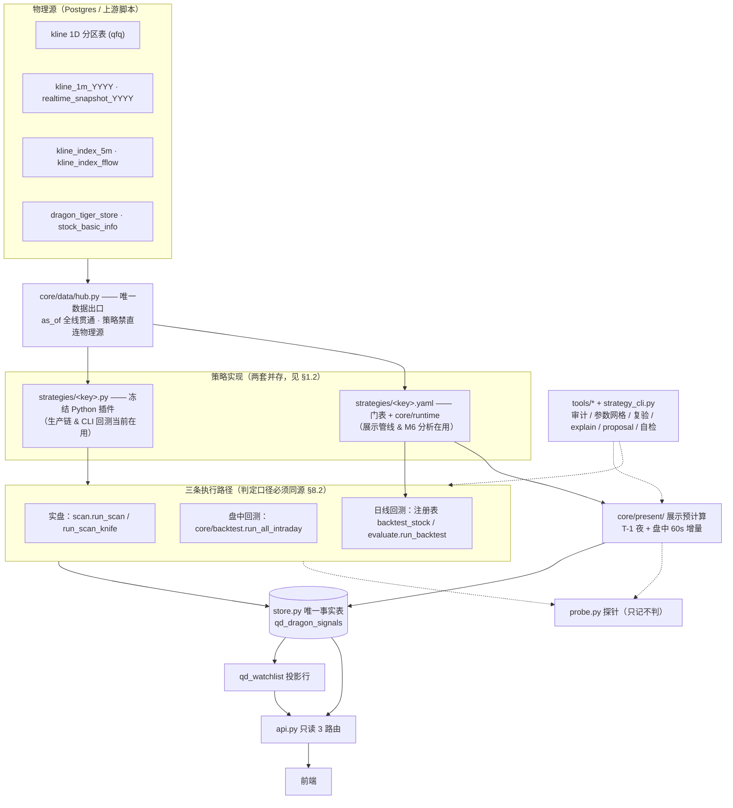
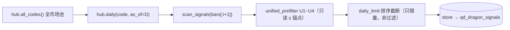

# 自动策略系统设计（单一事实源）

> **版本 v3.0 ｜ 2026-09-20 ｜ 状态：生效中 —— 本文档是本系统的唯一设计事实源。**
>
> **范围**：`backend_api_python/app/market_cn/auto`（自动策略引擎：盘后扫描 / 盘中扫描 / 回测 / 落库 / 展示数据 / 分析工具）。
> 不含：展示前端、agent 盘口与资金流、数据采集上游（它们只作为"物理源"出现在 §3）。
>
> **定位**：一份文档讲完 **架构 + 数据流向 + 策略规范 + 纪律 + 工具链 + 现状 + 操作手册**，
> 人和 AI 都不必再去翻别的文件。

---

## 0. 怎么读这份文档

| 你想知道 | 去哪节 |
|---|---|
| 系统长什么样、谁调谁 | §1 §2 |
| **数据从哪来、流到哪去**（含真实表名） | §3 |
| 怎么写/改一个策略（门表 YAML） | §4 §11.1 §11.2 §11.3 |
| 涨跌停、T+1、板块这些规则写在哪 | §5 |
| 今晚怎么看到明天 | §6 |
| 我该用哪条命令调策略 | §7 |
| **改代码前必须遵守什么** | §8 |
| 改完怎么证明没搞坏 | §9 |
| **盘中成交能力**（分层取数 / 两段拼接 / 缺口容错 / exec_engine 三档） | §3.8 §4.7 §6.4 §9.5 §10.5 §11.7 |
| 现在做到哪了、哪些还没做 | §10 |
| 出场逻辑为什么老出 bug | §4.6 §8.3 §11.4 |

**约定**
- 路径一律**相对仓库根** `D:\QuantDinger`；`auto/` = `backend_api_python/app/market_cn/auto`。
- 文档里出现 `旧路径`（`ide/` / `common/` / `data/hub.py` / `auto/backtest.py`）**一律已失效** —— 2026-09-20 目录重组，见 §10.3。

**事实源优先级（冲突时，上位覆盖下位）**

| # | 来源 | 说明 |
|---|---|---|
| 1 | **代码** `auto/**` | 策略规则、字段名、函数签名，代码是最终事实 |
| 2 | `auto/config.json` | 策略开关 / 参数覆盖 / 调度窗口（唯一配置域） |
| 3 | **本文档** | 架构、纪律、数据流向、操作手册 |
| 4 | `.workbuddy/memory/*` | 项目记忆（踩坑、历史裁定），**不作为设计依据** |

> ⚠️ 单条策略的**判定规则**以 `strategies/<key>.yaml` 的门表表达式（或 `<key>.py` 代码）为准，
> 本文档**不复述规则**（避免两处漂移），只在需要举例时引用片段。

---

## 1. 系统全景

### 1.1 一张图



**三处汇聚（读图要点）**
1. **hub** —— 所有数据在此汇聚一次；策略永远只见 hub 交出的 `dict/list`，**看不见任何物理表**。
2. **策略** —— 三条路径在此汇聚一次；判定口径必须同源，否则"回测≠实盘会买什么"。
3. **store** —— 所有落库在此汇聚一次；`qd_dragon_signals` 是唯一事实表，`qd_watchlist` 只是它的**投影**。

### 1.2 ⚠️ 必须先理解：现在有**两套策略实现并存**

这是当前系统最容易看错的地方。同一个策略 `dragon_callback` 同时存在 `dragon_callback.py` 与 `dragon_callback.yaml`：

| 引擎 | 载体 | 谁在用（实测 import 链） | 验证状态 |
|---|---|---|---|
| **冻结 Python 插件** | `strategies/<key>.py`（自含 `scan_signals` / 出场引擎） | **生产**：`scan.py`（扫描落库）/ `monitor.py`（盘中状态机）；`api.py` 只读它们写入的 `store`（不经策略）；**CLI 回测**：`core/backtest.run_all`（经注册表）；由 `strategies/__init__.py: autodiscover` 注册 | 线上在跑 |
| **门表引擎** | `strategies/<key>.yaml` + `core/runtime/`(`expr`/`functions`/`evaluate`) | **展示预计算**：`core/present/pipeline.py`、`intraday.py`；**分析闭环**：`tools/explain.py`、`tools/m6_check.py`；闸门：`market_spec_check`、`path_parity` | **7 策略逐笔等价 0 不一致**（§9） |

- 两套的**判定语义已被证明等价**（逐笔 trade 字段逐一比对），这是迁移期的"双实现 + 等价证明"状态，不是分叉。
- 门表 YAML 是**目标形态**（§4）；`.py` 插件是**逃生舱**（复杂策略/未转写策略），两者会长期共存。
- `core/backtest.run_all`（`strategy_cli.py run` 的落点）**走注册表 → .py 插件**；想跑 YAML 门表请用 `explain` / `m6_check` / `present`。
- **门函数与展示口径已各自单份**（§10.6 / §10.8）：`core/runtime/strategy_funcs.py` 已删；策略私有门随 `strategies/<key>.py` 走、共享门在 `core/runtime/gate_stdlib.py`、展示档位映射在 `core/display_meta.py`。两套实现**共享同一份门函数实现**，不再"改一处要同步另一处"。

---

## 2. 分层与目录

### 2.1 目录树（2026-09-20 重组后的实测结构 = 目标态）

```
auto/
├── core/                       # L0 内核（稳定；不出现任何市场常量、表名、SQL）
│   ├── _paths.py               # ★ 项目根唯一锚点（结构化判据：向上找同时含 app/ 与 run.py 的目录）
│   ├── market.py               # ★ MarketSpec + 涨跌停/分板原语（唯一实现）
│   ├── exec.py                 # ★ 成交假设唯一实现（跳空价/跌停不可成交/一字板 + P1 fill_intraday + P3b replay_sell_intraday）
│   ├── filters.py              # ★ U1~U4 统一预过滤（唯一实现）
│   ├── indicators.py           # 技术指标（MA/MACD/KDJ/RSI/BOLL/ATR/ROC/PSY…）
│   ├── entry_modes.py          # 入场模式（open/close/intraday/auction）
│   ├── exit_modes.py           # 出场模式（当前为按策略组合：dragon_combo/v1_combo/relay3_s4/break_combo/g56_no_trail/d1_open）
│   ├── backtest.py             # 回测编排：run_all（日线/注册表 + exec_engine 三档）/ run_all_intraday（时间线引擎）
│   ├── display_meta.py         # ★ 展示口径映射：CONFIRM_LEVELS + confirm_level_of（排除在判定指纹外，见 §10.8）
│   ├── data/
│   │   ├── hub.py              # ★ 唯一 IO 出口（通道函数）
│   │   ├── kline.py            # 日线取数：fetch_kline_db（逐票）/ fetch_klines_batch（批量分片）
│   │   └── frames.py           # 分钟帧内核：MinuteFrame + build_frame + series(code, upto_pos)（盘中 as-of 截断）
│   ├── features/              # 上层特性层（组合 / 质检纯函数；零市场常量）
│   │   ├── minute_composite.py # ★ 两段拼接 + 分层取数（hybrid_series/plan_tiers/window_minutes/minute_live_full；DEFAULT_MINUTE_DAYS）
│   │   └── quality.py         # 数据质量分级（detect_gap_anomaly/grade_series/grade_minute_window）
│   ├── present/
│   │   ├── pipeline.py         # 展示预计算：夜候选 + 盘中增量 + verify_split（门表 YAML）
│   │   └── intraday.py         # 门表盘中通道（run_all_intraday_ide，与实盘同判定路径）
│   └── runtime/
│       ├── expr.py             # 受控表达式：白名单 AST 求值 + static_asof_check（拒绝正偏移）
│       ├── functions.py        # Ctx（24 个内置方法）+ OFFSET_FUNCS/D0_DEPS + 注册机制（register_function / register_strategy_funcs / build_funcs）
│       ├── gate_stdlib.py      # 共享门函数 11 个（obv_rising/no_lu_last/macd_hist_lt/boll_bw_ok/board_height/ma_bull/is_bse/ret_n/d1_vol_ratio/is_approx_limit_up/pk）
│       └── evaluate.py         # 门表编排：Gate/StrategySpec/load_strategy/GateEvaluator/run_backtest
├── adapters/                   # L1 桥接（所有"具体实现"在这层）
│   └── markets/                # registry.py + a.yaml / hk.yaml / us.yaml / polymarket.yaml
├── strategies/                 # L2 策略
│   ├── base.py                 # 插件类属性契约（见 §4.6）
│   ├── __init__.py             # 插件注册表：register/get_strategy/all_strategies/autodiscover + config 读取
│   ├── <key>.py  × 11          # 冻结插件（逃生舱；生产链当前在用）；私有门函数经 register_strategy_funcs 随本文件走（§10.6）
│   └── <key>.yaml × 8          # 门表单文件（目标形态；与同名 .py 逐笔等价；含 1 个禁用 legacy）
├── features/                   # 策略私有特征 provider（env_flow：大盘资金面）；框架特性层在 core/features/
├── tools/                      # 离线 CLI（21 个，见 §7.2）
├── config.json                 # 唯一配置域
├── scan.py                     # 实盘路径执行体：run_scan（盘后）/ run_scan_knife（盘中窗口）→ 写库
├── startup.py                  # 启动对账：reconcile_startup → _rebuild_worker；判定/展示**两段指纹**（§10.7）
├── rebuild.py                  # 历史重建：统一 scan_days 契约 + 批量取数 bars_batch（§10.7）
├── monitor.py                  # 盘中状态机：run_monitor（三决策，60s）
├── store.py                    # 事实表 DDL + CRUD + qd_watchlist 投影同步
├── api.py                      # 只读展示面：/dragon/today、/dragon/markers、/dragon/strategies
├── sched.py                    # 盘中窗口时刻展开（expand_times / resolve_schedule）
├── probe.py                    # 统一探针层（DayTrace / sample_feats / Probe；只记不判）
└── registry.py                 # 策略成员视图（strategy_keys/labels/winrate）+ 状态常量 + 中文文案
```

> `registry.py`（auto 顶层）与 `strategies/__init__.py` 是**两个不同**的注册表：
> 前者给 store/api 用（"系统里有哪些策略成员"），后者是**插件注册表**（类的注册与发现）。

### 2.2 依赖方向（禁逆向 import）

```
core/data/hub  ←  core / features  ←  strategies  ←  registry  ←  scan·monitor·core/backtest  →  store  →  api
                                                                    ↑                              │
                                                                    └──────── tools（离线 CLI）─────┘
```

| 层 | 允许 import | 禁止 |
|---|---|---|
| `strategies/*` | `base`、`core`、`features`、`core.data` | `registry`、`scan`、`monitor`、`store`、`api`、兄弟策略 |
| `core/*` | `core.data`（+ `adapters` 仅在 `runtime/evaluate` 读 market） | `scan`、`monitor`、`store`、`api` |
| `adapters/*` | `core`（**单向**：core 不 import adapters） | 任何上层 |
| `scan` / `monitor` / `core/backtest` | 上述 + `registry` + `store`（写） | — |
| `api` | `store`（只读）、`registry` | 一切写路径、一切判定逻辑 |
| `tools/*` | 全部（离线工具，**不进 HTTP 进程**） | — |

### 2.3 红线：只允许有一份实现

| 能力 | 唯一实现 | 禁止 |
|---|---|---|
| 成交假设（跳空成交价 / 跌停不可成交 / 一字板 **+ 盘中触线 `fill_intraday` / `replay_sell_intraday`**） | `core/exec.py` | 任何策略/工具内联 `fill_on_gap` 一类逻辑 |
| 分钟取数分层 / 两段拼接 | `core/features/minute_composite.py` | 整窗拉 1m / 自拼分表 SQL / 复制拼接逻辑 |
| 数据质量分级（跳空 / 缺拍 / 停牌） | `core/features/quality.py` | 写死 10% 阈值 / 各自实现分级 |
| 涨跌停 / 分板 / 板块中文名 | `core/market.py`（读 `adapters/markets/*.yaml`） | 任何地方写 `0.098` / `"30"` / `"沪主板"` 字面量 |
| U1~U4 预过滤 | `core/filters.py:unified_prefilter` | 复制一份到策略里 |
| 分钟 as-of 切片 | `core/data/frames.py: series(code, upto_pos)` | 自己切 bars |
| 项目根路径 | `core/_paths.py` | "从本文件回退 N 级"（见 §10.4 欠债） |
| 数据出口 | `core/data/hub.py` | 策略直接连 DB / HTTP |
| 事实表 | `store.py` 的 `qd_dragon_signals` | 新建第二张"信号表" |

> **已知例外（待收敛）**：出场判定目前有**多份副本** —— `core/exit_modes.py`、`strategies/*.py` 的策略私有出场引擎、
> `monitor.py` 的盘中出场分支、`dragon_callback.py:run_backtest_dragon_callback` 等。
> 它是 `fill_on_gap` 一类"按不可得价格成交"bug 的温床 —— **改出场逻辑必须逐份核对**（见 §11.4）。

---

## 3. 数据流向

### 3.1 物理源 → hub 通道（真实表名）

| 通道（hub 函数） | 物理源 | 粒度 / 复权 | 时效与限度 |
|---|---|---|---|
| `daily(code, days, as_of)` | 日线 `kline_1D_<YYYY>` **分区表** | 日线 / **qfq**，最大 5 年 | 盘后更新（15:30 batch） |
| `minute_1m(...)` | `kline_1m_YYYY` | 1m / **不复权原始价**，≈5 个月（~110 交易日） | **盘后批回填**（离线），**不是**实时流 |
| `quote` / `market_snapshot` / `day_series` / `minute_live` | `realtime_snapshot_YYYY` | 60s/拍（可能丢拍） | **盘中唯一通道**，保留 5 工作日 |
| `daily_live(code, days)` | `daily` + 当日快照 → `synth_bar` | 合成当日 bar | 盘中构造 D0；`reconcile_daily_live` 逐日对账 |
| `index_daily` | 上游 index.py 降级链 + 磁盘缓存 | 日线 | L2 盘后补数；缓存新鲜则零外网 |
| `index_minute` | `kline_index_5m` | 5m | `scripts/sync_index_*` 落库，无磁盘缓存 |
| `index_fflow` | `kline_index_fflow` | 5m | 同上（盘中每 5 分钟幂等重写，EM host 有 ~15min 延迟） |
| `lhb(...)` | `market_cn/dragon_tiger_store` | 名单型事件（**不** OHLVC 化） | 交易所 ~17:00–17:30 发布 → **只允许消费 ≤ D-1** |
| `stock_info()` | `stock_basic_info` | 股本/名称/状态 | U1~U4 换手、市值、ST 判定依据 |
| `all_codes()` | 同上（active） | 代码表（无时间语义） | 全市场池 |

**数据层三大陷阱（务必记住）**
1. **跨层复权混算**：`daily` 是 qfq、`minute_1m` 是不复权原始价 → 混算有除权偏差。换算**必须显式**走 `app/data_sources/provider/adjustment.unadj_to_qfq`，**hub 不静默换算**。
2. **`minute_1m` 是离线储备数据**：只能用于"当日 D0 合成 bar / 历史日内回放"，**绝不能**当实时行情喂盘中决策（实时只走 `realtime_snapshot_YYYY`）。
3. **快照表按年分表**、且**可能丢拍** → 跨年回看/对账要显式处理。

### 3.2 判定链与 as-of 截断点



| 层 | as-of 职责 | 说明 |
|---|---|---|
| 全市场池 | 无 | 代码表本身无时间语义 |
| `hub.daily(as_of=D)` | **数据层兜底第一道闸** | 即使策略忘了切片，数据层也挡住未来 bar |
| `scan_signals` | **只读索引 ≤ i** | 策略自身的切片义务（i = 决策日） |
| `unified_prefilter` | 只读 ≤ **锚点** | 锚点由策略 `prefilter_anchor` 决定（`signal` / `limit_up`） |
| 盘中分钟序列 | `frames.series(code, upto_pos)` → `min(off+upto_pos, off+n)` | 截断到"当前分钟" |
| 日线基准 | `_daily_asof(code, prev_date)` | 截至 D-1 |
| `daily_limit` | 无过滤语义 | 纯限量；0 = 不限 |
| 落库 | — | 信号一经入库即为当时快照，后续**只改状态不改判定** |

### 3.3 三条执行路径必须同源

| 路径 | 入口 | 用途 |
|---|---|---|
| **实盘** | `scan.run_scan`（盘后）/ `scan.run_scan_knife`（盘中窗口） | 线上信号，**写库** |
| **盘中回测** | `core/backtest.run_all_intraday` | 分钟级回放（时间线引擎） |
| **日线回测** | 注册表 `strategy.backtest_stock`（.py）/ `evaluate.run_backtest`（YAML） | 长周期评估 |

**历史教训（已修，务必别重犯）**：`run_all_intraday` 调 `scan_signals` + `intraday_exit`，
但**完全缺 U1~U4**，而另两条路径都施加 → 盘中回测信号集发散、与实盘不等价。
修法：在 `run_all_intraday` 内按 `use_unified_prefilter` 守卫补上同源 U1~U4，
锚点复用 `scan._anchor_idx`（**同一函数**，保证三路径锚点一致）。该纪律由 `tools/path_parity.py` 常驻看守。

### 3.4 存储与状态机

| 表 | 角色 | 关键约束 |
|---|---|---|
| `qd_dragon_signals` | **唯一事实表**（状态机全量 + 历史） | `UNIQUE(trade_date, strategy, code, entry_style)` |
| `qd_watchlist` | "自动策略组"**投影**（活跃信号） | 由 `store.sync_watchlist_group()` 全量对账；引擎独占读写删 |
| `qd_scheduler_done` | 调度幂等标记 | `PRIMARY KEY(task_name, trade_date)`，防补跑重复执行 |

```
watch_pending →(entry_decision)→ buy_today →(confirm_decision)→ holding
              →(exit_decision / 收盘重放)→ exit_today → closed
特殊态: expired（弱确认 / 开盘 gap 放弃 / 超时）
entry_at_close=True 的策略（dragon_callback / tail_oversold）无 gap 环节，落库即 buy_today。
```

- **Signal 只带判定结果**；`state` / `entry_price` / `stop_price` 等状态机字段**归框架**（`monitor.py` 维护）。
- 状态中文文案：`config.json:state_labels`（兜底在 `registry.state_label`）。
- 注意：`registry.py` 里另有**旧 V2** 状态常量（`S_BUY_TODAY = "buy_today"` 等），与上表同名同义，是给 api/store 用的符号别名。

### 3.5 展示链（谁读谁）

| 环节 | 现状 |
|---|---|
| 生产展示面 | `api.py` **直接读** `store`（`qd_dragon_signals` + `qd_watchlist`），**只读**、不做二次判定 |
| 预计算管线 | `core/present/pipeline.py` 已实现（T-1 夜候选 + 盘中增量 + `verify_split` 自检），**尚未接线到 HTTP** |
| 前端 | 只读 `api` 的 3 个路由：`/dragon/today`、`/dragon/markers`、`/dragon/strategies` |

### 3.6 调度时序（`app/market_cn/scheduler.py: TASKS` 实测）

| 任务 | 触发 | 说明 |
|---|---|---|
| `realtime_snapshot` | 每 **60s**（仅盘中） | 快照表刷新（盘中唯一实时通道） |
| `dragon_pools` | 每 300s（仅盘中） | 自选池刷新 |
| `fast` / `slow` | 300s / 1800s（仅盘中） | 盘口/情绪刷新 |
| `fflow_intraday` | 每 300s（仅盘中） | `kline_index_fflow` 轮询 |
| `dragon_monitor` | 每 **60s**（仅盘中） | 盘中状态机（三决策） |
| `morning_batch` | **06:00** once_per_day | 早间批 |
| `post_market_batch` | **15:30** once_per_day | 盘后批（日线就绪） |
| `dragon_hot_daily` | **17:00** once_per_day | 龙虎榜落库（LHB ~17:00–17:30 发布，未发布自动重试） |
| `dragon_scan` | **17:25** once_per_day | 盘后全市场扫描（**刻意晚于龙虎榜落库**，杜绝 LHB 时序错位） |
| `knife_scan` | **14:30**（兜底）once_per_day | 盘中窗口扫描；**实际触发时刻以 `config.json:schedule` 各策略 first 最早者为准**（`sched.resolve_schedule`） |

> `once_per_day` 由 `qd_scheduler_done` 表 + `mark_scheduler_task_done` 保证幂等。
> 盘中窗口声明是**每策略**的：`config.json:schedule.<key>.windows = [首次, 截止]`、`interval_sec = 拍间隔`。

### 3.7 交易日内一条完整时序

```
T-1 盘后 17:00 龙虎榜落库 → 17:25 run_scan 全市场 → 命中写 qd_dragon_signals(watch_pending)
T-1 夜   （目标态）present.precompute_night：资格门 + needs_d0=0 的门 → 明日候选集
T 日 14:30 起  knife_scan / 盘中窗口：run_scan_knife（快照合成 D0 bar）
T 日 14:50–15:00  dragon_callback 窗口：每分钟判定 → 反转确认 → 落库 buy_today（收盘买入模式）
T 日 15:01+ monitor 盘后确认：confirm_decision → holding（watch_pending 类的策略在此转态）
T+1 起  monitor 60s：exit_decision（止损/追踪/到期）→ exit_today → 次日开盘执行 → closed
T+1 起  展示：api.py 读事实表 → 前端
```

---

### 3.8 盘中成交的数据供给：分层取数 + 两段拼接 + 缺口容错（框架级）

> **定位**：这是"能力供给层"的纪律，与具体策略无关。盘中成交（买入触发 / 止损）依赖
> "这一拍价格是否触及某线"，**数据供给的质量直接决定判定是否可信**。
> 方案原稿见 `docs/盘中成交能力设计方案.md`（已并入本节，保留备查）。

#### (a) 两套分钟通道，性质截然不同（方案地基，别混用）

| 维度 | `kline_1m_YYYY`（回测） | `realtime_snapshot_YYYY`（实盘） |
|---|---|---|
| 生成时机 | **盘后**回填（挂 `post_market_batch`） | **盘中实时**（60s/拍） |
| 完整性 | 完整（每交易日全分钟） | **可能缺拍** |
| 保留期 | 实测 ~157 交易日（约 7.5 月）；`hub.py` 以 **~100 工作日** 为保守值 | **仅 5 工作日**（`_cleanup_old_snapshots`） |
| 复权 | 原始价 → 回测侧 `frames._qfq_bars` 转 qfq | 原始价 → 同因子源 `unadj_to_qfq` |
| 缺口表现 | 停牌股自然缺席 | **静默丢空槽，调用方无从感知** |

⇒ **硬约束**：实盘盘中**拿不到当天 1m**（盘后才有）；回测**不该用快照**（不完整）。
**不得假设"回测怎么算，实盘就能怎么算"**。

#### (b) 分层取数成本纪律 —— **能用 1D 就不用 1m**

- 量级事实：单交易日 1m = 240 行 vs 1D = 1 行（**240×**）；100 交易日整窗 1m ≈ 24000 行/票 × 5000+ 票 = **亿级行** → 取数 / 复权 / 建槽位全部塌方。
- 近端窗口 `N` = **绝对最近 N 个交易日**，单点常量 `core/features/minute_composite.DEFAULT_MINUTE_DAYS`（**默认 100**，可调；**禁止散落硬编码**）。
- **唯一常规取数入口** `minute_composite.hybrid_series()`：近端 N 日 → 1m，远端 → 1D；两档**互斥、不丢日**（近端某日 1m 缺失 → 回落 1D）。
- ⚠️ **禁止整窗 1m**。⚠️ `N=100` 时窗口 ≤100 交易日即"全窗 1m"（分层退化）；300 日窗口下（1m 覆盖 ~157 日）1m 占比 64% → 实测仅 **1.01×** 收益。
  ⇒ **默认 = 精度优先**；速度敏感（参数扫描 / 全市场长窗）**显式调小** `minute_days`（如 10 → 实测 **7.76× / 10.51× 行数**）。
- 分界按**交易日**（`plan_tiers` 取序列尾部 N 日），非自然日。

#### (c) 两段拼接：`kline_1m`（历史基底） + `realtime_snapshot`（当日尾部）

把日线粒度已有范式（`hub.daily_live` = 历史日线 + 今日合成 bar）**下沉到分钟粒度**：

- 历史段 = `kline_1m` 取历史交易日，经 `_qfq_bars` 转 qfq；实时段 = 当日快照 → `prep_minutes(volume_cumulative=True)`。
- **去重判据（用户裁定，一句话）**：`kline_1m 有该日数据 → 用 kline_1m（精确）；无 → 用 realtime_snapshot`。
  ⇒ 盘中看是拼接、盘后 `kline_1m` 回填后被精确数据替换 → **盘中 / 盘后自动收敛到同一口径**，且盘后可自洽校验。
- **收益**：① 5 天保留期**不再构成边界**（历史走 `kline_1m`，实盘盘中回看 = ~100 工作日 + 当日段）；② 实盘与回测的**历史部分完全一致**，不可比性被压缩到"仅当日尾部"。
- 落点 `core/features/minute_composite.minute_live_full`（**薄封装**：仅组合现有 `hub.minute_1m` + 快照，**不改数据层**）。改动限于 `auto/` 内（`hub.py` 可改，`db_market.py` ∈ `auto/` 外**禁止**）。
- `window_minutes(code, start, end)`：按**真实窗口**取（P3b / P4 精修专用），绝不为几笔候选拉整窗 1m。

**缝合点四问题（拼接的唯一新增风险，已逐项处理）**

| # | 问题 | 处理 |
|---|---|---|
| 1 | 复权口径不一致 | 三段（1D / 1m / 快照）**同一函数同一因子源** `adjustment.unadj_to_qfq` → 无假跳空 |
| 2 | 缝合处空缺 | 当日开盘前几拍缺失 → 历史段末根（昨 15:00）与实时段首根（今 9:3x）之间有缺口 → 前导缺口检出 + 标注 |
| 3 | 时间戳基准 | 历史段末根 = 昨日 15:00、实时段首根 = 今日 9:31 → **跨日跳空是正常的**，不误判为缺口 |
| 4 | 重复槽位 | 当日 `kline_1m` 回填后同时存在于两段 → 按日期去重（判据见上） |

#### (d) 缺拍不静默：缺口可观测 + 数据质量分级

- `hub.prep_minutes(..., report_gaps=False)`：`True` → 返回 `(bars, gaps)`，`gaps = [(mi_start, mi_end, n_missing), ...]`；**默认 `False` → 返回形态不变（既有调用点零改动）**。
- `core/features/quality.py`：
  - `detect_gap_anomaly(bars, *, board_type, spec, margin_pp=1.0, ex_div_idx)` → `[(idx, kind, detail)]`，`kind ∈ {ex_dividend(除权·跳过) / abnormal_gap(真跳空)}`；**跳空阈值分板块**（`MarketSpec.nominal_up_pct` + `margin_pp`，如主板 10.8% / 创业板 20.8%），**不得写死 10%**；
  - `grade_series(...)` → 四级 `ok / warning / error / suspend`（`abnormal_gap` 落在成交区间 → `error`；空序列 → `suspend`；`ex_dividend` 不计入）；
  - `grade_minute_window(minutes, *, board_type, spec, touched, ex_div_idx)` → 一步封装（`detect_gap_anomaly` + `grade_series`），供回测精修与展示链**共用**（避免两处接线漂移）。
- **裁定（用户）**："**数据完整度不是 auto 负责的事，警告即可**" ⇒ 缺口**只标注不阻断**；`error` 级**不删交易**，报告可筛。
- **裁定（用户）**："监视 = 展示层、快速决策、**无回溯性**" ⇒ 缺拍只是"当拍决策依据减弱"，**不追责、不盘后补判**；仅将来接**自动下单**时才需"缺拍拒绝成交"的硬守卫（另立阶段）。
- **裁定（用户）**：集合竞价段（9:26）**不参与回测、不参与成交引擎**，仅作展示层预留；`prep_minutes` 的 `tmp[mi]` 后写覆盖机制已使竞价拍被开盘首拍顶掉（**价格侧安全**）。
  ⚠️ 残留（**独立待办**，不在本能力范围内）：竞价量未从累计量扣除 → 依赖量能的盘中判定有小偏差（价格不受影响）。

#### (e) 跨年分表与 as-of

- **跨年分表已自动**：`kline_1m_YYYY` / `realtime_snapshot_YYYY` 读写两端均按年路由（`db_market._group_by_year` / `range(start.year, end.year+1)` 遍历年表、跳空表 `continue`）；`hub.minute_1m` 正是调该 year-aware query ⇒ **天然成立，本能力无新增工作**。
- **as-of = 复用槽位机制**（用户裁定）：回测侧一律走 `run_all_intraday` 的 `snaps_at(mi)` 槽位机制，**不新增 `upto_mi` 参数 / 第二套截断语义**；拼接在回测语境**只作槽位引擎的数据源**，不被判定代码整段直接调用。
- **分段式**：`kline_1D` 初筛（日线天然按日截断）+ `kline_1m` 精修（按槽位推进）→ as-of 天然成立。
- **结构成立 ≠ 证明成立**：**分段式是设计，未来扰动法是验收**（§9.3），二者不可替代。

---

## 4. 策略规范：一个 YAML 一个策略（目标形态）

### 4.1 文件结构（**实测**字段，非设想）

```yaml
# strategies/dragon_callback.yaml —— 一个策略的全部
meta:
  name: 龙回头              # 中文名（进展示文案）
  market: A                # A / HK / US / Polymarket → 决定 MarketSpec 各正交维度（§5）
  version: 1
  # ↓ day 族才有（见 §4.4）
  enumeration: day         # limit_up（默认，dragon）/ day（v1/relay3/break/g56）/ intraday（knife/tail）
  day_flow: v1             # day 流程口径：v1 / relay3 / break / g56（选哪个枚举器）
  day_start: 25            # 逐日起点（镜像参考实现的 range 起点）
  day_end: 9               # 终点回退（g56: n-9 留引擎缓冲）
  day_min_n: 30            # 低于此长度直接返回空
  ext: g56                 # 编排层预计算上下文（Ctx.ext）注册名，见 §6.2

entry:                     # → core/entry_modes.resolve_entry
  mode: close              # open | close | intraday | auction
  at: "14:56"              # close 模式的终审时刻（此前为滚动预览）
  price: close             # 成交价基准
  # open 模式常配 gap 门（v1/g56）：gap_min/gap_max/gap_exclude_band/require_d1_close_up

exit:                      # → core/exit_modes.run_exit
  mode: combo              # hold | trail | stop | signal | combo（+ 策略专属：v1_combo / g56_no_trail / relay3_s4 / break_combo）
  stop: -5.0               # 硬止损 %
  trail: -5.0              # 追踪止损 %（自入场后峰值回撤）
  max_hold: 15             # 到期天数
  peak_exit_ret: 7.0       # 峰值逃顶：收盘涨幅阈值 %
  peak_exit_upper: 30.0    # 峰值逃顶：上影线占比阈值 %

params:                    # 可调参数（网格扫描/敏感性直接读这里；可被 config.json 覆盖）
  min_pullback_days: 3
  max_pullback_days: 11

gates:                     # 门表：一行一门
  - {id: g1, name: 末期缩量小阴, role: qualify, needs_d0: 0, enabled: 1,
     expr: "chg(-1) > -max_last_chg and chg(-1) < -0.5 and vol_ratio(-1) >= min_vol_ratio"}

signal:                    # 可选：门通过后要算的展示字段（与参考版 trades 逐字段一致）
  fields:
    rhist_chg: {expr: "g56_feat('rhist_chg')", fmt: r3}
```

**为什么是单文件 YAML**（已定案，2026-09-20）
1. **能写注释** —— 策略调试最该留下的是"为什么加这道门"，CSV 做不到；
2. **不会不同步** —— 拆两个文件必然"改了门表忘了改参数"，单文件是原子的；
3. **好 diff / 好复制** —— 一个文件一个策略，`cp` 改两行即新变体；
4. **可嵌套** —— `signal:` / `state:` 这类结构 CSV 表达不了。

门表保持**一行一门**的 flow style（`{...}`）：视觉上仍是表格、diff 一行一个语义单元。
想用 Excel 的人将来可走 `qd export <策略> --csv`（**尚未实现**，见 §10.4 欠债 #8 同类）—— **格式是 YAML，表格只是视图**。

### 4.2 门表字段

| 字段 | 含义 |
|---|---|
| `id` | 门编号（引擎按声明序求值，短路） |
| `name` | 中文名（直接进展示文案，策略不用另写 label） |
| `expr` | **受控表达式**（只能调内核函数与字段，见 §4.3） |
| `role` | `qualify` = 资格门（可夜算） / `required` = 判定门（依赖 D0 或 lu_idx） / `audit` = 只记录不拦截 |
| `needs_d0` | 该门是否读**买入日 T** 的行情（展示端夜/昼切分依据，见 §6.1）；`0` / `1` |
| `enabled` | `1` / `0`，置 0 = 临时关掉某门做对照实验 |

### 4.3 表达式语言（受控，非 Python）

- **允许**：内核函数、数值常量、比较与逻辑运算（`and` / `or` / `not` / `between` 一类由函数提供）、括号、字符串参数。
- **禁止**：任意 Python 语句、`import`、IO、循环、跨股票引用。
- **偏移语法**：`chg(-1)` = 前一日涨跌幅；**只允许 ≤ 0 的偏移** —— 正偏移在 `expr.static_asof_check` 层直接拒绝（as-of 静态保证）。
  偏移函数名集合：`core/runtime/functions.py: OFFSET_FUNCS`（`chg` `vol_ratio` `open/high/low/close/volume` `is_limit_up` `ma` `rsi` `macd_*` `kdj_*` `boll_*` `atr`）。
- **函数来源**
  | 类别 | 落点 |
  |---|---|
  | Ctx 方法（24 项，恒绑定） | `core/runtime/functions.py: Ctx` |
  | 共享门函数（11） | `core/runtime/gate_stdlib.py`（`obv_rising` `no_lu_last` `macd_hist_lt` `boll_bw_ok` `board_height` `ma_bull` `is_bse` `ret_n` `d1_vol_ratio` `is_approx_limit_up` `pk`） |
  | 策略私有门函数 | `strategies/<key>.py` 模块级 `register_strategy_funcs("<yaml-stem>", {...})`；键 = **YAML stem**（不是模块名），见 §10.6 |
  | 用户自定义 | `functions.register_function(name, fn, is_offset=False, needs_d0=None)` —— 注册即生效，**不用改求值器** |
- **D0 依赖声明**：`D0_DEPS` / `REGISTERED_D0`。`0` = 只读 ≤ i-1（可夜算）；未声明 → 保守视为读决策日（不会误算）。

### 4.4 枚举方式（`meta.enumeration`）—— 引擎级编排，不进门表

| enumeration | 适用 | 语义 |
|---|---|---|
| `limit_up`（默认） | dragon_callback | 先 `find_limit_ups` 得涨停日 `lu_idx`，**按 lu_idx 升序遍历**，首个"全门通过"者出信号 |
| `day` | v1 / relay3 / break / g56 | 逐日枚举决策日 i，门表一次性求所有门；`meta.day_flow` 选枚举器（`_run_backtest_day_v1/_relay3/_break/_g56`） |
| `intraday` | knife_catch / tail_oversold | 分钟时间线引擎（与实盘同判定路径） |

> **循环依赖属于引擎**：dragon 的"涨停 → 回调 → 反转"遍历是引擎编排，门表只表达"给定 (决策日 i, 涨停日 lu_idx) 是否放行"。

### 4.5 `signal:` —— 展示字段（可选）

门通过后求值的展示字段（`{expr, fmt}`，`fmt ∈ r1..r6`）。目的是让 YAML 版与参考 `.py` 版的 trades **逐字段一致**（逐笔等价验收要求）。

### 4.6 逃生舱：`.py` 插件契约（`strategies/base.py`）

| 类属性 | 默认 | 含义 |
|---|---|---|
| `key` / `name` | — | 注册键（= `qd_dragon_signals.strategy` = config 键）/ 中文名 |
| `default_params` | `{}` | 参数默认值；优先级 `config.json > 代码` |
| `prefilter_anchor` | `"signal"` | U1~U4 锚定日：`signal` = 信号日（末根 bar）/ `limit_up` = 最近涨停日 |
| `use_unified_prefilter` | `True` | 扫描层是否施加 U1~U4 |
| `signal_state` | `"watch_pending"` | 落库初始状态；盘中即买设 `buy_today` |
| `entry_at_close` | `False` | 入场在尾盘/收盘（T+1 当日不可卖，monitor 跳过当日止损守卫） |
| `exit_exec_same_day` | `False` | 出场当日执行并当日平账（默认次日开盘执行） |
| `rolling_preview` | `False` | 窗口起点起每分钟滚动预览，终审时刻定稿 |
| `data_needs` | `("daily",)` | 数据需求声明（hub 按声明加载，未声明通道零加载） |
| `entry_style` / `family` / `family_version` | `"a"` / 空 / 1 | 同策略多形态区分 / 版本链去重 |
| `scan_spec` | — | 扫描规格（kind / windows / interval_sec / entry_at） |

**判定接口**：`scan_signals(bars, code, *, as_of=None, ctx=None, **params) -> list[Signal]`
（`as_of=None` 判末根 bar = **实盘语义**；`as_of=k` 判第 k 根 = **回测枚举语义**）

**三决策**（均有智能默认实现，按需覆盖）：`entry_decision`（是否买入）/ `confirm_decision`（持仓确认）/ `exit_decision`（出场）。

---

### 4.7 盘中入场 / 出场：`entry_modes.intraday` 与成交原语（框架级）

> **用户裁定（2026-09-21）**：盘中成交（买入 / 卖出 / 回测短线的盘中口径）是**框架能力**，
> 不是策略私有实现；**策略规则不应被约束**（策略只"声明"要不要用）。

#### (a) 入场模式 `entry.mode: intraday`（第 3 种模式，与 `close` / `open` 并列）

- `.py` 插件经 `resolve_entry` 分流；YAML 写 `entry.mode`。两条腿（同一判定代码、不同数据）：

| 腿 | 数据 | 触发 / 成交价 |
|---|---|---|
| **日线近似腿** | 当日 OHLC | `high >= trigger` 视为触发；成交价 = `exec.fill_intraday(bar, trigger, side='buy')` |
| **1m 真实腿** | 1m 槽位序列 | 找**首个**满足触发条件的槽位；成交价 = 该槽位 `open` |

- ⚠️ 成交价**统一走 `exec.fill_intraday`**（早期草写的 `fill_on_gap` 已弃用）—— 符合"新能力复用 P1 原语"。
- 报告**必须标注**用的是哪条腿（**"近似腿结果 ≠ 真实腿结果"**）。默认关闭。
- `needs_d0` 推导：`entry.mode=intraday` 已由 `pipeline.decision_offset` 归为偏移 0（当日）。

#### (b) 成交原语（`core/exec.py`，**唯一实现**；买 / 卖对称，复用 `fill_on_gap` / `fill_blocked_by_limit_dn`）

| 原语 | 语义 |
|---|---|
| `fill_intraday(bar, trigger, *, side, dn, up, spec)` → `(price, filled)` | 卖：`low <= trigger` 触线；买：`high >= trigger`；开盘已越过 → 按开盘（gap 语义）；成交价贴跌停(卖)/涨停(买) → `filled=False`（引擎置 pending 顺延）；未触线 → `(None, False)` |
| `replay_sell_intraday(minute_bars, *, entry_price, stop_line, trail_pct, require_profit, dn, peak, spec)` → `(fill, mi, peak_after)` | 在**当日分钟序列**上按时间序重放卖出腿（**同槽位内先止损后追踪**）；成交价**完全复用** `fill_intraday`；追踪线 = **该槽位开始时已知的峰值** `× (1+trail_pct/100)`（峰值逐槽推进 ⇒ **无日内先视伪影**）；触线但贴跌停 → 继续扫后续槽位 |

- **只做原子判定 / 原子扫描，不持有状态机**（`pending_dn` / 顺延指针 / 到期仍归各引擎 —— 各引擎顺延语义不同，硬抽象会造 bug）。
- ⚠️ 盘中价必须用**开盘时已知的峰值**（`peak_prev`），否则出现"先用当日 `high` 抬线、再回判当日 `low`"的**日内先视伪影**（上轮实测 601579）。

#### (c) 出场：日线策略复用其日线出场引擎，仅把成交价从 `close` 换成 1m 盘中价

- `StrategyBase.intraday_replay(bars, entry_idx, entry_price, *, code, board_type, minute_by_date)` 默认 no-op；`BreakStrategy` 已实现（**共用同一出场引擎**）。
- **只做硬止损腿**：实测 `fill_mode=intraday_stop` 硬止损腿 PL 1.16 > 追踪腿盘中化**有害**（603989 −31.9pp）⇒ **勿做追踪腿盘中化**。
- `core/backtest.run_all(strategy, ..., exec_engine=None)` **三档分流**（**入口参数，不污染 `scan_spec.kind`**）：

| `exec_engine` | 行为 | 速度 |
|---|---|---|
| `None` / `daily` | 纯日线枚举（**现状默认，逐笔零变化**） | 最快 |
| `intraday` | 强制整窗 1m（仅调试 / 小样本 / 上线前验收） | 最慢（240× 行数） |
| `auto` | **分段式**：候选窗口并集经 `window_minutes` 最小取数 → 1m 精修；入口日早于近端 `DEFAULT_MINUTE_DAYS` 边界 → **整笔**日线腿 | 中 |

- `_refine_intraday` 纪律：**逐笔只选一档**（`trade["exec_basis"] = "1m" | "daily"`）—— 持仓窗口内 1m 完整才走 1m 腿，否则**整笔**保留日线腿（**禁止半段 1m / 半段日线**，口径混合会污染阈值结论）；实测（days=120 / 42 笔）`exec_basis_counts = {'1m': 23, 'daily': 19}`。

---

## 5. 市场适配：MarketSpec（core 零市场常量）

### 5.1 正交维度（四市场取值）

| 维度 | 字段 | A | HK | US | Polymarket |
|---|---|---|---|---|---|
| 当日回转（**交易限制**） | `intraday_t0` | **false**（当日新开仓不可当日平） | true | true | true |
| 结算周期（交割，仅影响资金可用） | `settlement_days` | 1 | 2 | 1 | —（事件结算） |
| 结算基准 | `settlement_basis` | calendar | calendar | calendar | **event** |
| 方向 | `direction` | `long_only` | `long_short` | `long_short` | `long_short`（YES/NO 二元面） |
| 做空规则 | `short_rule` | `none` | `designated + tick` | `RegSHO + alt_uptick` | `synthetic_no`（买 NO，非借券） |
| 价格边界 | `price_band` | `pct`（板块分档） | `none`（+VCM） | `none`（+熔断） | `bounded[0,1]` |
| 每手 / 最小价位 | `lot_size` / `tick_size` | 100 / 0.01 | 不固定 / 按价 | 1 / 0.01 | 1 / 0.01 |
| 币种 / 时区 | `currency` / `tz` | CNY / CST | HKD / HKT | USD / ET | USDC / UTC |
| 费用模型 | `fee_model` | 佣金 + 印花税 | 佣金 + 印花税 | 佣金 | taker fee（按类别） |

> **设计要点**：把"T+N"拆开 —— **交易限制**（`intraday_t0`，A 股 T+1 是"当日新开仓不可当日平"）
> 与**结算周期**（`settlement_days`，交割慢）是两件事，旧设计混成一个字段 → 接港股必改 core。
> 账户级约束（美股 PDT / GFV）**不进 MarketSpec** —— 它们是账户属性，由执行适配器承载。

### 5.2 A 股基线：`adapters/markets/a.yaml` 是**唯一事实源**

| 项 | 值 | 说明 |
|---|---|---|
| 涨跌停（主板） | `up_pct 0.098 / dn_pct 0.10 / up_tol 0.98 / dn_tol 0.002` | 数值**逐字搬自旧硬编码** |
| 涨跌停（创业板/科创板） | `up_pct 0.198 / dn_pct 0.20` | — |
| 未命中板块档位 | `band_default: gem_star` | **刻意**复现旧实现 `else: 0.198` 的分支语义（改它会破坏逐位等价） |
| 分板规则 | `board_rules: 30→gem_star, 68→gem_star`；`board_default: main` | 有序，先匹配先生效 |
| 板块中文名 | `68 科创板 → 30 创业板 → 6 沪主板 → 0 深主板 → 2 深主板` | **68 必须在 6 之前**（复现旧 if/elif 次序） |
| 交易单位 | `lot_size 100` / `tick_size 0.01` / `currency CNY` / `tz CST` | — |

**签名兼容（冻结插件零改动）**：`is_limit_up(close, prev_close, board_type, spec=None)`、
`limit_dn_price(prev_close, board_type, spec=None)` —— `spec=None` 时取进程默认市场（import registry 时注入 A 股）。

### 5.3 fail-fast：**绝不**静默降级

- `load_market(未知 key)` → `KeyError`
- `require_runnable(spec)`：HK / US / Polymarket 声明 `runnable: false`（数据源未接）→ 抛 `MarketNotRunnable`
- 策略 YAML 写 `market: HK` 时 `load_strategy` **立即失败** —— 绝不悄悄按 A 股阈值跑出一个"看着成功"的错结果。

### 5.4 接新市场 = 加一份 YAML（有闸门证伪）

`tools/market_spec_check.py` 第 4 项会**落一份探针 yaml → 让注册表加载 → 全程对 `core/**` 做文件哈希比对**，
用"core 哈希零变动"**证伪**"是不是真的没改 core"，而不是靠口头声明。

---

## 6. 展示：今晚就能看到明日

### 6.1 三级预计算时序

```
T-1 夜    资格门 + needs_d0=0 的门  → 全市场 → 明日候选集（大幅收窄）
D0 盘中   仅候选集内 needs_d0=1 的门 → 合成 D0 bar，每分钟增量
14:56     终审 → 落库 +（目标）推送
```

- **needs_d0 语义**：该门是否需要**买入日 T 当日**行情。决策日 i 相对 T 的偏移由 `entry.mode` 决定：
  `open` → i = T-1（**门表全部可夜算**）；`close` / `intraday` / `auction` → i = T。
- **自动推导优先**：`present.reads_decision_bar` 静态遍历表达式 AST（偏移函数看 `args[0]` 是否可折叠为 <0；
  非偏移函数查 `D0_DEPS` / `REGISTERED_D0`，未声明按"读决策日"保守处理）。管线**用推导值**，
  `audit_needs_d0` 只做对账。危险方向是 `under`（声明 0 / 推导 1）。
- **分段求值可证明等价**：`open` 模式 i = T-1 即历史末根（无占位）；`limit_up` 枚举夜侧必须保留**全部**夜门通过的
  `lu_idx`（只留首个会漏信号），日侧再按升序取首个 → 合成即"首个 night ∧ day 全过者"。

### 6.2 `Ctx.ext`：编排层预计算上下文

策略 YAML 用 `meta.ext: <name>` 声明，实现注册在 `present.EXT_PROVIDERS`（如 g56 = 个股 G1 特征数组 + 当日横截面池）。
展示 / 回测 / 实盘**同源构造**，按 `(code, ext)` 记忆化避免重复 O(n)。

### 6.3 性能：现状 + 已知瓶颈（诚实记账）

| 段 | 实测 | 预算 | 判定 |
|---|---|---|---|
| 日线加载（共享缓存） | ~16s | 8s | **超** |
| 夜段（含 g56 池 ~9s） | ~14s | 10s | **超** |
| 盘中（帧 + 快照 + day 门） | ~0.3s | 6s | OK |
| **合计（20 策略 / 全市场 5234 只）** | **31.65s（中位）** | 30s | **临界** |

- **三条达标前提**：① 共享数据加载（20 策略共用一次加载：104711 次取 bars 只触发 5234 次加载）✅
  ② 门求值向量化/预计算（AST 缓存 + 短路口 + 精简绑定已做，**未做向量化**）⚠️
  ③ 盘中只算 `needs_d0=1` 的门（夜候选 78 项 / 去重 27 只 → 盘中只求值 93 次门）✅
- **测量纪律**：同一份代码跨时段复测 **29.9–34.1s**（SQL 取数浮动）→ **跨时段比总量不可靠**，必须**同小时内 A/B**。
- **已回退的尝试（别重踩）**：`unadj_rows_to_qfq`（省 0.7s，但多一份复权实现 → 收益 < 可读性代价）；
  分片数 6→4（差值在噪声内）。
- **后续最高优先级**：把 T-1 夜产物（g56 横截面池 / 夜候选集）**真正落盘缓存**（`_ensure_pool_daily` 目前按日期 keyed，
  在不同 `as_of` 下会重复全市场重载 —— 这也是 §10.4 里 selftest as-of 段不可用的根因）。

---

### 6.4 展示层数据完整度标注（`data_quality`）

- 落点：`core/present/pipeline.py` 的 `DayHit` 新增 `data_quality: str = "ok"` + `data_quality_reasons: List[str]`；`intraday_cycle` 内用 `_snapshot_quality(snap, trade_date)` 判定（只看**当日快照累计字段**的完整性：缺快照 / 日期不匹配 → `warning`；缺 `last/open/high/low` → `error`；正常 → `ok`）。
- 语义：**如实标注、不假装完整、不阻断决策**（展示层无回溯性，见 §3.8 裁定）。评估出错时返回 `"ok"`（避免异常吞掉排查信号）。
- 与 §3.8 的 `grade_minute_window` 同源四级（`ok / warning / error / suspend`），只是**数据源不同**（展示层用当日快照累计字段；回测精修用该笔分钟窗口）。
- **零影响面**：门表求值 / 门 / 字段 / 命中数 **均不受影响**（只在 `DayHit` 上挂标签）。

---

## 7. 工具链与 CLI

### 7.1 单一入口：`backend_api_python/strategy_cli.py`

**与 `run.py` 同级 = 接线层；纯壳**（参数解析 + 注册表分发 + 结果排版），`core/` 与 `scan.py` 一行不改。

```bash
python strategy_cli.py run <策略> [--days N] [--today] [--today-date D] [--codes ...] [--json] [--out F]
python strategy_cli.py today <策略>          # = run --today（--today-date 单独给也隐含 today）
python strategy_cli.py list                  # 已注册策略（key / 中文名 / scan_kind）
python strategy_cli.py replay|debug|gates|grid|explain|stats|pool|proposal ...  # 转发 tools/*.main()
python strategy_cli.py debug <策略> --code 000001 [--date D]   # 单候选逐门追踪
```

| 项 | 事实 |
|---|---|
| 直达 | `run / today / list` → `core.backtest.run_all`（**走注册表 → .py 插件**） |
| 转发 | `replay / debug / gates(=audit) / grid / explain / stats / pool / proposal` → 补 `sys.argv` 调 `tools/*.main()`（argparse 保持唯一出处） |
| 位置式策略名 | `qd replay v1` / `qd debug v1` 的首个非选项 token 由本壳归一成 `--strategy <key>`（**含别名解析**）—— 各工具 argparse 只认 `--strategy`，此前文档写的 `qd replay <策略>` 实际会报"未知位置参数"（2026-09-21 修，一处修好全部 8 个转发子命令） |
| `--today` 口径 | 按**买入日 `entry_date`** 过滤（与 `test_dragon.py` 同口径），**非信号日**；缺省=今天；该日无买点则列最近有买点的交易日 |
| 别名 | `dragon→dragon_callback` / `dragon2→dragon_v2` / `break_buy→break`（仅本壳与 `replay.py` 认；core 的 `__main__` 不认） |
| 板块中文名 | 走 `core.market.get_board_name`（spec 驱动） |
| ⚠️ 已知坑 | `core/backtest.py` 内嵌 `__main__` 的默认 `--strategy dragon` **是坏的**（注册表无此 key → `ValueError`）；调试请统一走本壳 |
| ⚠️ PowerShell | 未加引号的 `--codes 000533,000859` 会被 PS 解析成**数组**、数字丢前导零（`000533`→`533`）→ **静默 0 结果**。必须 `--codes "000533,000859"`（本壳按 `[,\s]+` 切，两种分隔都认） |

### 7.2 `tools/` 清单（21 个模块，全部离线、不进 HTTP 进程）

| 工具 | 用途 |
|---|---|
| `selftest.py` | 策略契约测试闸门（AST + 契约 + as-of）。**盘中策略 as-of 会 SKIP**，见 §9.4 |
| `path_parity.py` | **三路径同源自检**（静态扫内联副本 + 日线族/盘中族判定等价） |
| `market_spec_check.py` | **市场适配闸门**（6 项，退出码 = 失败项数，见 §5.4） |
| `present_bench.py` | 展示管线达成度实测（20 策略 / 30s 预算） |
| `rule_audit.py` | 门级规则审计：拦截表 + 判别力 + 换序稳定性（**走插件 `RULE_DEFS` 路径**） |
| `rule_stats.py` | 入场规则归因统计（固定持有口径） |
| `param_scan.py` | 参数网格 + OFAT 敏感性 + 两段稳定性 + whatif 逐笔 diff + 邻域平台/尖峰判定 |
| `pool_check.py` | **信号级复验闸门**（universe/kept/dropped → MIGRATE/VETO + 两段），强制闸门 |
| `verify_prefilter.py` | 预筛等价验证（`intraday_shortlist` 必须是完整判定的必要条件超集） |
| `replay.py` | 单股单策略重放调试（逐笔明细：判定特征 + 出场原因；**整窗视角**） |
| `debug.py` | **单候选判定追踪器**（单票 × 单日）：门表策略**逐门打印 门名/表达式/计算值(含叶子函数值)/通过否** + 入场出场结论；`.py` 策略走自带 TRACE；盘中策略逐触发槽位复现。补 `replay`（整窗）/`rule_audit`（全市场聚合）/`gate_dbg`（只有布尔）的盲区 |
| `explain.py` | **门表策略机器可读报告**（JSON + MD + 探针 JSONL），M6 载体 |
| `gate_funnel.py` | **面向 agent 的策略漏斗接口**：把 `explain` 的市场全量逐门漏斗封装为**返回 dict 的可调用函数**（零新计算逻辑）；全市场 >500 股须 `force_full_market=True` 确认 |
| `gate_try.py` | **面向 agent 的候选规则试算**：在漏斗第 `at` 道门的到达池上一次性试算多条候选表达式，出两侧统计 + Δ；附 `window_ok` 窗口安全告警（防 fail-open 偏乐观） |
| `proposal.py` | **LLM 建议产物** + 红线校验 + apply(默认 dry-run) + revert，M6 载体 |
| `m6_check.py` | M6 四项验收自检 |
| `new_strategy.py` | 新策略脚手架生成器 |
| `bench_scan.py` | 盘中扫描 50s 预算基准 |
| `snapshot_quality.py` | **快照通道质量对账**（T-1 拼接 vs `kline_1m` 真值；P3.7，盘中成交能力载体） |
| `sample_build.py` / `ml_baseline.py` | ML 旁支：统一样本库构建 / GBDT 基线（**冻结中**，非主链） |

### 7.3 `probe.py`：统一探针层（只记不判）

- `DayTrace`（单日判定轨迹）、`sample_feats(bars, i, code, stock_info)`（特征快照）、`Probe`（会话对象）。
- 总开关 `config.json:live_probe`（默认 true）；盘后扫描按策略产 sample 存 `tmp/probes/`。
- **标签 censored 由离线回填**（探针本身不算收益）。
- 定位：**回测负责对数验证，selftest 负责契约验证，probe 负责调试** —— 三者互补，互不替代。

---

## 8. 不变量与纪律（改代码前必读）

| # | 纪律 | 为什么 | 怎么自检 |
|---|---|---|---|
| 1 | **as-of 不可破**：`scan_signals` 只能用 `bars[:i+1]`；门表表达式只许 ≤0 偏移 | 未来函数 = 回测骗自己 | `expr.static_asof_check`（加载期）+ **未来扰动实测**（§9.3） |
| 2 | **三条路径同源** | 否则"回测 ≠ 实盘会买什么" | `tools/path_parity.py` |
| 3 | **唯一实现**（§2.3） | 副本漂移是 bug 温床 | `path_parity` 静态段扫内联副本 |
| 4 | **core 零市场常量** | 接港股/美股不改 core | `tools/market_spec_check.py`（AST 扫字面量） |
| 5 | **参数全走 `merged_params`**，禁硬编码 | 网格扫描/覆盖才有效 | `selftest` 契约项 |
| 6 | **规则改动必经两段稳定性**（单段有效 = 过拟合）+ `pool_check` 信号级复验 | 防止把噪声当规律 | `param_scan._seg_stats` + `pool_check` |
| 7 | **策略禁 import DB / HTTP / 其它策略**；调试代码只写策略文件内 | 保证可回测、可拔插 | `path_parity` / `selftest` |
| 8 | **预筛必须是数学必要条件**（宁可多留不可误杀） | 预筛误杀 = 信号丢失 | `tools/verify_prefilter.py` |
| 9 | **展示字段不写进策略文件**（除 `signal:` 声明的展示字段） | 展示统一口径 | — |
| 10 | **生产只跑展示面**；回测走 CLI，不进 HTTP 进程 | 避免回测拖垮服务 | — |
| 11 | **改动留工作区，禁 git 指令** | 用户审阅制 | — |
| 12 | **删除一律移 `D:\QuantDinger\del\`**（不直接删） | 安全删除 | — |
| 13 | **文档/代码落盘必须取证** | Edit 会**静默失效** | 写后重读或 grep；大段替换走 python patcher（先打印 count 再写盘） |
| 14 | **行尾不统一**：架构文档 = LF；记忆与 `strategy_cli.py` = CRLF | 混合行尾会破坏锚点匹配 | python patcher 须探测原 eol 再写回 |
| 15 | **取数分层成本纪律**：能用 1D 就不用 1m；1m 只覆盖近端 `DEFAULT_MINUTE_DAYS`（默认 100）交易日；**禁止整窗 1m** | 1m 行数 = 1D 的 240×，整窗会拖垮取数/复权/建槽位 | 走 `minute_composite.hybrid_series`；`meta.rows` 报告行数 |
| 16 | **数据可达性显式化**：实盘盘中只能读 `realtime_snapshot`（**5 天、可能缺拍**）；回测读 `kline_1m`（**盘后、完整**）；不得假设"回测怎么算实盘就怎么算" | 两通道性质不同、不可比 | 声明依赖通道 + 缺拍降级；报告标注 |
| 17 | **缺拍不静默**：缺口必须可观测（`prep_minutes(report_gaps=True)` / `quality.detect_gap_anomaly`），只标注不阻断 | 静默丢空槽会让引擎"用错价成交" | 人造缺口注入测试；`data_quality` 四级 |

---

## 9. 验收门禁：改完怎么证明没搞坏

### 9.1 命令清单（按"改动面"选跑）

| 改动面 | 必跑 |
|---|---|
| 任何 `core/**` 改动 | `py_compile` / `compileall` → `tools/selftest.py --no-asof` → `tools/path_parity.py` → `tools/market_spec_check.py` → 逐笔等价抽跑 |
| 策略门表/参数 | `tools/param_scan.py`（两段）→ `tools/pool_check.py` → `tools/explain.py` 报告 |
| 出场逻辑 | **逐份副本核对**（§11.4）+ 逐笔等价 |
| 目录搬迁 | **导入面冒烟**（顶层 + `core/*` + `adapters` + `tools` + `app.market_cn.scheduler`）+ 上述全套 |
| 展示管线 | `core/present/pipeline.py --verify N`（分段等价）+ `tools/present_bench.py` |
| 盘中成交（`core/exec.py` / `core/features/minute_composite.py` / `quality.py`） | `tmp/_p4_verify.py` + `tmp/_p3b_verify.py`（零回归 / as-of 扰动）+ 逐笔等价 + `path_parity`（证唯一实现），详见 §9.5 |

### 9.2 逐笔等价电池（门表版 vs 冻结 Python 插件，全市场，**0 不一致**）

| 脚本 | 覆盖 | 结果 |
|---|---|---|
| `tmp/_m1_equivalence.py` | dragon_callback：77,761 候选日逐 i 信号 + 逐笔字段 | PASS |
| `tmp/_v1_equivalence.py` | v1 全市场 5223 只 | PASS（137 vs 137） |
| `tmp/_relay3_equivalence.py` | relay3 | PASS（178 vs 178） |
| `tmp/_break_equivalence.py` | break | PASS（94 vs 94） |
| `tmp/_g56_equivalence.py` | g56 | PASS（1191 vs 1191） |
| `tmp/_intraday_equivalence.py --strategy knife_catch / tail_oversold` | 盘中族 | PASS |
| `tmp/_v22_asof_verify.py` | 未来扰动法（dragon_callback 79/79） | PASS |

### 9.3 as-of 验证方法：未来扰动法（可复用）

对每个信号日 D，把 `bars[D+1:]` 的价格与量**全部打乱**后重跑，比对**决策字段**
（是否出信号 / 入场价 / 锚点日期 / 结构参数 / buy_mode）必须完全一致；
**出场与收益字段本就合法依赖未来，不参与比对**。

> ⚠️ **覆盖缺口**：`tools/selftest.py` 对**盘中策略**的 as-of 检查项是 **SKIP**。
> 因此 **"selftest ALL_PASS" 不足以证明 as-of** —— 改动判定逻辑后**必须**跑未来扰动实测。

### 9.4 已知不可用项

`selftest.py` **全量 as-of 段事实上不可用**（卡 40 分钟以上）：`check_asof` 对每策略取 ~41 个 `k` 逐次调
`scan_signals`，而 g56 的 `_ensure_pool_daily(pool_target)` **以 pool_target 日期为缓存键** → 41 个不同 k =
41 次**全市场重载**。
**日常用 `selftest --no-asof`（AST + 契约，秒级）**；as-of 语义另有 path_parity / present --verify / 逐笔等价覆盖。

---

### 9.5 盘中成交能力专属门禁

| 改动 | 必跑 |
|---|---|
| `core/exec.py` 新增 / 改动原语 | `compileall` → `selftest --no-asof` → `path_parity`（**证唯一实现**）→ `market_spec_check` → `tmp/_break_equivalence.py`（0 不一致） |
| `core/features/minute_composite.py`（分层 / 拼接） | **缝合四问题逐项** + **as-of 未来扰动法**（§9.3）；确认**未改 `auto/` 外基层**（`db_market.py`） |
| `core/features/quality.py`（分级） | 真实样本：除权日跳过 / 停牌标 `suspend` / 缺拍标 `warning` / 真跳空 `error`（**分板块阈值**） |
| `core/backtest.run_all(exec_engine=)` | **零回归**（`daily` 逐笔 0 差异）+ `auto` 分档报告（`exec_basis_counts`）+ as-of 扰动 |
| `hub.prep_minutes(report_gaps=)` | **既有调用点返回形态不变**（默认 `False`）→ `present_bench` / `selftest --no-asof` → 抽日用**人造缺口**验证检出 |
| 展示层 `data_quality` | 幂等 + 边界 + **缺拍注入**（人造缺口 → 断言标注） |

**缺拍测试方法（可复用）**：取某日某股真实快照序列，**人为删掉中间连续 N 拍** → 走判定 →
断言"检出缺口 + 按分级标注"。这是**唯一能证明容错真的有效**的方法（真实数据里缺口偶发，不能等）。

**红线三闸（用户既定）**：不碰 core 市场常量 / 不绕两段等价 / 不删 qualify 合规门。

---

## 10. 当前状态（截至 2026-09-23）

### 10.1 迁移阶段

| 阶段 | 内容 | 状态 |
|---|---|---|
| **M1** | 门表求值器 + 金融函数库 + 1 策略逐笔等价 | ✅ 完成 |
| **M2** | 入场/出场模式模块 + 成交语义唯一实现 + 三路径同源 | ✅ 完成（`path_parity` 常驻看守） |
| **M3** | 展示预计算管线（T-1 夜 + 盘中增量） | ⚠️ **已实现但未达标 30s**（31.65s）；U1~U4 与基础资格门**尚未以 `role=qualify` 门进入管线**；管线**未接 HTTP** |
| **M4** | 其余策略转写；Python 插件保留为逃生舱。**策略侧自包含已落地（§10.6）** | ⚠️ 8 个 YAML（含 1 个禁用 legacy）已逐笔等价；`break_v2` / `dragon_v2` / `triple_resonance` 仍只有 `.py`。`.py` = 生产链、YAML 门表 = 展示链，两者共用同一份门函数实现 |
| **M5** | MarketSpec + 目录重组到目标态 | ✅ 完成（HK/US/Poly 只有 `MarketSpec` 声明，`runnable: false`） |
| **M6** | LLM 分析闭环（报告 → 一行改动 → 校验/应用/回滚） | ✅ 完成（**不内接 LLM API**，只交付工具链） |

### 10.2 策略清单（`config.json` 是事实源）

| key | 中文名 | kind | enabled | 有 YAML | daily_limit | 备注 |
|---|---|---|---|---|---|---|
| `dragon_callback` | 龙回头 | intraday_window | ✅ | ✅ | 5 | 当前活跃工作；14:50–15:00 窗口，14:56 终审 |
| `dragon_v2` | 龙回头V2 | daily_close | ✅ | ✗ | 5 | 2026-09-13 曾裁定留档，**09-20 实测已重新 enabled** |
| `v1` | V1 | daily_close | ✅ | ✅ | 5 | D0 四因子 → 次日开盘 |
| `break` | 断板 | daily_close | ✅ | ✅ | 5 | — |
| `relay3` | 3板接力 | daily_close | ❌ 已关闭 | ✅ | 2 | 门表仍逐笔等价；`daily_limit` 保留 2 |
| `knife_catch` | 反向接刀 | intraday_window | ✅ | ✅ | 0（不限） | 14:30–15:00 |
| `tail_oversold` | 尾盘超卖超短 | intraday_window | ✅ | ✅ | 0（不限） | 14:50–15:00 |
| `g56` | 五重共振 | daily_close | ✅ | ✅ | 30 | 有 `ext: g56`（横截面池）；夜段最重 |
| `break_v2` | 断板V2 | — | ❌ 留档 | ✗ | 5 | — |
| `triple_resonance` | 三金叉共振 | — | ❌ 留档 | ✗ | 0 | — |

> **记账更正（2026-09-24 复核）**：本表曾记 **8 enabled**（把 `relay3` 算作启用），与 `config.json` 实测不符。
> **以 `config.json` 为准**：当前 **7 enabled**（`dragon_callback` / `dragon_v2` / `v1` / `break` / `knife_catch` /
> `tail_oversold` / `g56`）、**3 关闭**（`relay3` / `break_v2` / `triple_resonance`）。
> 表内 `enabled` 列**逐次核对 config.json** —— 它是事实源，本表只是快照。

### 10.3 M5 目录重组（已完成，老路径一律失效）

| 旧 | 新 |
|---|---|
| `ide/expr.py functions.py strategy_funcs.py evaluate.py` | `core/runtime/`（`strategy_funcs.py` 已于 2026-09-26 删除 → §10.6） |
| `ide/present.py intraday.py` | `core/present/pipeline.py intraday.py` |
| `ide/entry_modes.py exit_modes.py` | `core/` |
| `common/exec_cn.py market.py indicators.py filters.py` | `core/exec.py market.py indicators.py filters.py` |
| `data/hub.py kline.py frames.py` | `core/data/` |
| `auto/backtest.py` | `core/backtest.py` |
| `ide/strategies/*.yaml` | `strategies/*.yaml`（与冻结 `.py` 同目录） |

### 10.4 已知欠债 / 边界（**别误读为已实现**）

| # | 欠债 | 影响 | 处置 |
|---|---|---|---|
| 1 | **§9.4 通道注册表未实现**：`core/data/hub.py` 仍直接持表名/SQL/复权 | 加新表要改 hub | 独立阶段（`ChannelSpec`/`ChannelRegistry`/`dispatch`/`adapters/sources/`） |
| 2 | **`adapters/execution/` 与 `orders.py` 未建** | 无实盘下单 | 后续 |
| 3 | **`t_legs/`（做T）未建**；`exit.on_resolution` 未实现 | 做T 与事件结算不可用 | 后续 |
| 4 | **HK / US / Polymarket 只有声明**（`runnable: false`），无数据源 | 按它们运行会 fail-fast | **设计意图**，不是缺功能 |
| 5 | **`selftest` 全量 as-of 段仍建议跳过**（日常用 `--no-asof`） | 纯静态快检可用；动态段对 g56 这类横截面策略代价高 | g56 侧已缓解：`prewarm()` 声明制 + `bars_batch=` 注入、池锚取 `hi_date`，**成本与当日枚举数 M 解耦**（§10.7） |
| 6 | **出场判定多副本**（§2.3） | `fill_on_gap` 一类 bug 温床 | 收敛到 `exit_modes`，需逐步做 |
| 7 | **`features/env_flow.py` 与 `tools/*` 仍用"回退 N 级"定位路径** | 目录一挪就静默指错 | 改用 `core/_paths.py`（仅 `core/**` 已收敛） |
| 8 | **展示管线未接 HTTP**（api.py 仍直接读 store） | 盘中增量/夜预计算未真正生效 | M3 收尾 |
| 9 | **两套策略实现并存** | 认知成本；改一处要同步另一处（或靠等价测试兜住） | 长期以 YAML 为主，`.py` 退为逃生舱。**门函数已单份**（§10.6）、**展示口径已拆出**（§10.8）⇒ 两套共享同一份门实现 |
| 10 | **`present_bench` 单次读数不可用于判断"变快了/变慢了"** | 误判 | 看原语级交错 A/B（§6.3） |

---

### 10.5 盘中成交能力落地状态（2026-09-21）

| 阶段 | 内容 | 状态 | 验收 |
|---|---|---|---|
| **P1** | `core/exec.fill_intraday` 原语 + `break_buy` 改用 | ✅ | 三档逐笔等价 **0 不一致** |
| **P2** | `entry_modes.intraday`（日线近似腿复用 `fill_intraday`，默认关） | ✅ | 9 组合成断言 + 两闸门；现有策略零影响 |
| **P3a** | 分层取数 `hybrid_series` / `plan_tiers` | ✅ | 24 断言 + 成本实测（N=10 → 7.76×；N=100/300 日仅 1.01×，**已如实记录**） |
| **P3b** | 1m 真实腿 `replay_sell_intraday` + `break_buy(minute_by_date=)` + `StrategyBase.intraday_replay` | ✅ | 21 断言 + 1m 独有增益；P1 基线零回归 |
| **P3.5** | 上层 `minute_live_full` 组合 helper（薄封装，改动限于 `auto/` 内） | ✅ | 缝合四问题 4 组断言 + 真实 DB 冒烟 |
| **P3.6** | `hub.prep_minutes(report_gaps)` + `core/features/quality.py` | ✅ | 7 组断言（缺口 / 午休 / 分板块阈值 / 除权 / 四级） |
| **P3.7** | `tools/snapshot_quality.py` 快照通道质量对账 | ✅ | 逐分钟对齐 `kline_1m` 真值；**环境无 DB 时优雅降级** |
| **P4** | `run_all(exec_engine=)` 三档 + `_refine_intraday`（`window_minutes` 最小取数） | ✅ | 零回归（days=120 逐笔 0 差异）+ `{'1m':23,'daily':19}` + as-of 扰动 |
| **P5** | 展示层 `data_quality` 标注（`DayHit` + `_snapshot_quality`） | ✅ | 幂等 + 边界 + 缺拍注入 |

**完成度：9 / 9 全落地，且全部零行为变化**（现有策略与运行时不受影响）。
**边界 / 未决（不影响能力可用）**：
1. `config.json` 尚未显式启用 `fill_mode=intraday_stop`（能力已就绪，按需开启）；
2. 竞价量口径（`kline_1m` 09:31 首根是否含竞价）—— 属**行为变更**，独立待办，**记录不改**；
3. `bars[:i+1]` 截断在断板链的语义（`break_days` 恒 = `i-streak_end`）待最终裁定。

---

### 10.6 策略自包含重构（2026-09-22 裁定 / 2026-09-26 落地）

**硬约束（铁律）：加一个策略或改一个策略，只允许动 `strategies/`。**

原先把策略私有门函数集中堆在 `core/runtime/strategy_funcs.py` ⇒ 每加一个策略都要改 `core/`，
`core/` 失去稳定性，且"谁的门"只能靠命名约定区分。现改为**注册制 + key 隔离**：

| 层 | 载体 | 说明 |
|---|---|---|
| 行情原语 | `core/runtime/functions.py` 的 `Ctx`（**24 个公开原语**） | `chg` / `vol_ratio` / `lu_close` / `pullback_days` / `monotonic_down` / `is_limit_up` / `count_limit_up` / `ma` / `rsi` / MACD 三值 / KDJ 三值 / BOLL 三值 / `atr`（私有助手 `_ema`/`_macd`/`_kdj`/`_boll`/`_atr`/`_bar`/`_check_k`/`_f` 不属原语） |
| 策略私有门 | `strategies/<key>.py` 模块级调用 `register_strategy_funcs(key, {统一名: fn})` | **随策略文件走**；键 = YAML 的 **stem**，不是模块名 |
| 共享门 | `core/runtime/gate_stdlib.py`（**11 门**，经 `register_function` 挂入） | `obv_rising` / `no_lu_last` / `macd_hist_lt` / `boll_bw_ok` / `board_height` / `ma_bull` / `is_bse` / `ret_n` / `d1_vol_ratio` / `is_approx_limit_up` / `pk` |
| 展示口径 | `core/display_meta.py` | 见 §10.8（不是门函数，别混） |

- 三张 **key-scoped 命名空间表**：`STRATEGY_GATE_FUNCS` / `STRATEGY_GATE_OFFSET` / `STRATEGY_GATE_D0`
  （另有全局的 `REGISTERED_FUNCS` / `REGISTERED_OFFSET` / `REGISTERED_D0` 供共享门用）。
- `build_funcs(ctx, key, names)` **按 key 组装**该策略可见的门集合；`ensure_gate_init()` 做一次性初始化。
- 堆料文件 `core/runtime/strategy_funcs.py` **已删除**（移入 `del/`）。
- 当前注册点共 **5 个**策略模块：`break` / `dragon_callback` / `g56` / `knife_catch` / `tail_oversold`。

**验收**：六策略逐笔等价全 PASS（`break` / `g56` / `v1` / `relay3` / `knife` 36/36 / `tail` 289/289），
`path_parity` + `market_spec_check` + import smoke 全绿。

**落地踩过的 5 个坑（全部已修，改注册制时逐条自检）**

| # | 坑 | 症状 |
|---|---|---|
| 1 | 注册 key 误用**模块名**（应为 YAML **stem**） | 该策略**全部门 NameError** |
| 2 | YAML 门名漏改（`g56_*` → `*`，共享门去掉前缀后） | 求值期找不到函数 |
| 3 | `GateEvaluator` 三处漏传 `key` | **系统 0 成交**（静默，最难查） |
| 4 | 策略模块漏模块级 `import` | 注册期 NameError |
| 5 | 缓存助手残留异名 | 取到旧函数，结果与 `.py` 不一致 |

---

### 10.7 重建与校准体系（2026-09-23 落地，铁律级）

**基准**：`scan.py:127 run_scan(days=320)`。历史重建**一律 `days=320`** —— 短窗口会经 MACD/ATR/RSI
的递归初值制造 ~1e-5 漂移，足以让贴阈值的样本翻转。

**统一契约 `scan_days`**（`strategies/base.py`，`scan_signals` 之下）：

```python
def scan_days(self, bars, code, *, lo_date=None, hi_date=None, **params) -> list[Signal]
```

- 语义 = "窗口内所有命中日"。默认实现 = **逐日截断 + `scan_signals`**（行为定义基准）。
- 覆盖条件：判定代价高到逐日枚举不可接受（全序列指标 / 横截面池）。覆盖实现**必须与逐日
  `scan_signals` 逐位一致**（g56 的做法见其模块内说明）。
- 编排层（`rebuild.py`）**禁写策略专属分支**，对所有策略一视同仁调这一个方法；循环形态 `for date: for strategy:`。

**真相源纪律**

- 真相源 = `scan_days` / g56 的 `_iter_gate_days` **生成器**（一次预计算 + 逐日 O(1)）。
- **禁逐日 `scan_signals(as_of=i)` 当真相源**：O(n²)，实测 **141× 慢**。
- `as_of=None` 只判末根；`backtest_stock` **不可作真相源**（末根信号会静默丢失）。
- G1 指标全部**因果** ⇒ 可全序列算第 k 日特征；引入非因果/双向平滑指标必须回退切片。

**g56 的横截面池口径**

- `_ensure_pool_daily(pool_target, bars_batch=None)`：池取数**不消费调用方传入的 bars**，
  默认内部 `hub.daily(code, 200, as_of=)`；`_POOL` 是**单槽**缓存。
- 逐日枚举场景**必须传 `bars_batch=`**（`rebuild.py` 传 `days=320` 的批量结果）；
  否则每票每天都重建全市场池。池一次建好后逐日查 ⇒ **成本与当日枚举数 M 解耦**。
- `prewarm(bars_map, hi_date)`：声明制预热，池锚取 `hi_date`。不预热的后果见 g56 模块注释。
- ⚠️ `knife_catch` / `tail_oversold` 是 `intraday_window` 策略 ⇒ **日线路径扫不到**，重建时显式跳过并报告。

**`rebuild.py` CLI**

| 参数 | 默认 | 说明 |
|---|---|---|
| `--window` | 无 | 增量窗口（交易日） |
| `--days` | **320** | 取数窗口，对齐 `run_scan` |
| `--strategy` | 无（全部） | 可重复 |
| `--limit` | 无 | 只取前 N 票（**仅调试**） |
| `--out` / `--json` | 无 | 文本 / 结构化报告落盘 |
| `--apply` | off | 真正写库（否则 dry-run） |
| `--ledger` | off | 顺带重放台账 |

**写库红线（5 条）**

1. `upsert_scan_signals` **禁用于历史重建** —— 会把 `holding` 打回 `watch_pending`，等于**丢持仓**。
2. `--limit` 下的横截面**不可信**（池只覆盖了前 N 票）。
3. 写库只碰**未推进行**；ghost 行分三类处置：可修 / 别动 / 残留。
4. ★★ `replay_ledger` **必须重放**：状态推进只发生在 `monitor.py`，且**每一步都锚"今天"**；
   重放须复用 monitor 的三个生产判定（不得另写一套）。
5. 显示层**停用策略只保留"已入场行"可见** —— 否则会遗忘卖出，属资金事故。

**启动对账与指纹两段化（`startup.py`）**

- `reconcile_startup()`（防重入）→ `_rebuild_worker()`（先 `run_scan`，后 `--ledger`）。
- 指纹拆两段，**边界 = 语义边界**：

| 段 | 内容 | 实测规模 | 触发 |
|---|---|---|---|
| `rules`（判定） | `_JUDGE_ENTRIES` 10 个入口 + **AST import 闭包**，排除 `_JUDGE_EXCLUDE`（`core/present/` / `core/display_meta.py` / `tools/`） | **37 个文件** | 变了 ⇒ 需重跑 rebuild |
| `display`（展示） | `_iter_display_files()` = `strategies/*.yaml` + `core/present/**.py` + `core/display_meta.py` | **12 个文件** | 变了 ⇒ **只需重启** |

- **快照只在 worker 成功后落盘**。否则进程在 300s 窗口内失败 → 指纹已更新 → **永久漏补**。

---

### 10.8 展示口径拆分（2026-09-23）

`CONFIRM_LEVELS = ("strong", "ok", "weak")` 与 `confirm_level_of(dec)` 现居 `core/display_meta.py`。

**为什么从 `strategies/base.py` 迁出**：`base.py` 是**判定契约**的所在地，被判定指纹按文件级粒度
覆盖。展示档位映射放在那里 ⇒ 只调一个展示文案也会改到 `base.py` 的哈希 ⇒ **白跑一次 300s 全量重建**。
文件级指纹切不开"判定改动"与"展示改动"，所以必须在**文件边界**上分开。

**为什么不放 `core/present/`**：`core/present/__init__.py` 是展示链 façade，import 它会拉起整条
展示管线（重依赖）。判定链（`monitor.py`）只需要一个纯映射函数，不该被拖进展示依赖。

- `_JUDGE_EXCLUDE = ("core/present/", "core/display_meta.py", "tools/")`。
- 调用方：`monitor.py` → `from app.market_cn.auto.core.display_meta import confirm_level_of`。
- **`dec.reason` 不是展示档位** —— 档位一律经 `confirm_level_of()` 归一，勿直取（`base.py` 已留注释）。

---

### 10.9 label 层联动（2026-09-23）

label 是**基座扩展层**（`app/watchlist/` + `services/`，与 agent/auto 零代码关系），
权威文档 `docs/自选股标签统一产出方案.md`。auto 侧只做**单向写**：

- **写入口**：`store._submit_labels_to_label_layer(active_rows)`（`store.py`）→ 基座 `submit()`，`grade=3`（auto 为最高等级）；
  `sync_watchlist_group` 尾部自动调用。
- **TTL**：`LABEL_TTL_TRADING_DAYS = 2`（**交易日**，不是日历日）。TTL 归提交方，基座不设默认上限。
- **`_label_payload(s)`**：构造 4 段（`supports` / `resistances` / `score` / `extras`）。
  auto 的答案不含筹码关键位 ⇒ `supports` / `resistances` **留空**；读路径有**段级回填**（次高等级行填空），
  空段不会抹掉 system 已有的答案。
- **缩减只删渲染行**：`auto` 的 extras 明细裁列是**显示决策**，**字段一个不删**（数据留库）。
- **禁令**：auto **不得回读** label 的 `score` 当策略输入（否则 label 与 auto 之间出现双向边，
  等级/回填语义会互相污染）。

---

### 10.10 `pre_confirm` 显示口径（2026-09-23）

**语义**：`pre_confirm` = 14:25~14:45 的**盘中预判**结果；15:00 收盘后由实盘判定**覆盖**。
它不是终态，只在 `buy_today`（当日待买入）语境下才有展示意义。

**病根**：`extra = extra || %s` 这类"只加不减"的更新方式 —— 当日覆盖后，**前一日的 `pre_confirm` /
`pre_ts` / `pre_reason` 会残留**，被当成今日预判展示。

**三段修复**

| 层 | 位置 | 做法 |
|---|---|---|
| 清残留 | `store.purge_stale_detail(keys, keep_state, keep_entry_date)` | 调用点 `monitor.py:396`（盘后）与 `rebuild.py:1013`（重建），键 `("pre_confirm", "pre_ts", "pre_reason")`，`keep_state=S_BUY_TODAY` |
| 归一口径 | `core/display_meta.confirm_level_of()` | 把判定结果映射为 `strong/ok/weak`；`detail['level']` 显式覆盖仅在取值落于 `CONFIRM_LEVELS` 内时生效，非法值静默走兜底 |
| 前后端双层防御 | 后端 `store._confirm_pre_text(state, d)`；前端 `strategyPreLevel` / `strategyPreConfirm`（`WatchlistPanel/index.vue`） | 两侧**同口径**：仅 `state == buy_today` 且档位合法时译「强/中/弱」，否则「已预判」；非 `buy_today` 行**不产出该行** |

**教训**：**`reason` 不是展示档位**。策略内部 token（如 `g56_hold`）直漏 UI 就是因为把
`reason` 原样当档位用 —— 展示档位必须经 `confirm_level_of()` 归一。

---

## 11. 常见任务手册

### 11.1 调一个已有参数 / 门阈值（最高频）

1. 改 `strategies/<key>.yaml` 的 `params:`（**优先**）或 `config.json:strategies.<key>.params`（覆盖）。
2. 跑两段稳定性：`python -m app.market_cn.auto.tools.param_scan --strategy <key> --grid '{"<param>":[v1,v2]}'`
   → 只认**两段全正**且**邻域是平台不是尖峰**的点。
3. 跑信号级复验：`python -m app.market_cn.auto.tools.pool_check ...` → 必须 **MIGRATE**（VETO 即回退）。
4. 逐笔等价抽跑（`tmp/_<key>_equivalence.py`）确认没动到既有语义。
5. 有 LLM/人写 proposal 时走 `tools/proposal.py validate → apply`（默认 dry-run，`--apply` 才写盘且备份）。

### 11.2 加一道门

1. 在 `<key>.yaml` 的 `gates:` **末尾**加一行 `{id, name, role, needs_d0, enabled, expr}`。
2. `expr` 只能用 §4.3 的函数；偏移必须 ≤ 0。
3. 若该门引用了新函数 → **只动 `strategies/`**（§10.6 硬约束）：
   - **只被本策略用** → 写在 `strategies/<key>.py`，模块级 `register_strategy_funcs("<yaml-stem>", {"fn": fn})`；
   - **多策略共用** → 写在 `core/runtime/gate_stdlib.py`，`register_function("fn", fn, needs_d0=...)`。
   两者函数体都只能读 `≤ i`（as-of 纪律）；**不要**为策略专属逻辑去改 `core/`。
4. 走 §11.1 的 2~4 步（加门 = 改选择集，**必须**两段 + pool_check）。
5. 若该门是"资格类"（可夜算）→ `role: qualify` + `needs_d0: 0`，并确认 `audit_needs_d0` 不报 `under`。

### 11.3 加一个策略

**A. 门表路线（推荐，A 股）**
1. 写 `strategies/<key>.yaml`：`meta`（含 `market: A`、`enumeration`、必要时 `day_flow/day_start/ext`）+ `entry` + `exit` + `params` + `gates`（+ 可选 `signal`）。
2. 在 `config.json:strategies.<key>` 声明 `label` / `enabled` / `daily_limit`（`schedule` 段仅盘中类需要）。
3. 若需独立特征 → 写 `features/<x>.py` 并在 `present.EXT_PROVIDERS` 注册 `ext`。
4. 跑 `tools/selftest.py --no-asof` → `tools/market_spec_check.py` → 有参考 `.py` 就跑逐笔等价。

**B. 插件路线（逃生舱：多腿/分钟级形态/自定义中间计算）**
1. `python -m app.market_cn.auto.tools.new_strategy <key> "<中文名>"` 生成骨架。
2. 填 `scan_signals`（+ 可选 `entry_decision`/`confirm_decision`/`exit_decision`）。
3. 在 `config.json` 声明成员；跑 `selftest`。

### 11.4 改出场逻辑（⚠️ 高危）

出场是**多副本**区（§2.3）。改之前先 `grep -rn "run_backtest\|_run_backtest\|exit_decision\|intraday_exit"` 列出全部副本，
逐份核对语义；改完**必须**跑对应策略的逐笔等价 + `path_parity`。历史教训：追踪线被当日 high 抬高时按"开盘价"成交
（`fill_on_gap` 误用）—— 正确语义是 `peak_prev + trig_prev`，`fill = open if open <= trig_prev else trig`。

### 11.5 加一张数据表 / 接一个新市场

- **新表**：目标态 = 在 `adapters/sources/` 加一个 `ChannelSpec` + 源适配器，策略 `data_needs` 加一行，**core 零改动**。
  **现状**：`ChannelSpec` 尚未实现 → 只能改 `core/data/hub.py`（欠债 #1）。
- **新市场**：加 `adapters/markets/<key>.yaml`（`runnable: true` 需先接数据源）→ 策略写 `market: <key>`。
  用 `tools/market_spec_check.py` 验证"core 哈希不变"。

### 11.6 排查：跑出来的数不对

| 症状 | 先查 |
|---|---|
| `n=0` / `codes_ok=0` 且不报错 | **PowerShell 传参**（`--codes` 没加引号 → 丢前导零，§7.1）；用 `tmp/_dbg_runall.py` 绕开 shell 直调 `run_all` 洗清引擎嫌疑 |
| 结果全 0 / 脚本 4 秒跑完 | 看输出文件里是否有 `FileNotFoundError`（**"跑得太快"是异常信号**） |
| 回测与实盘信号不一致 | `tools/path_parity.py`（三路径同源） |
| 疑似用了未来数据 | 未来扰动实测（§9.3）+ 检查偏移是否为负 |
| 收益与旧版不同 | 规格位等价（`tmp/_*_equivalence.py`），再查是否动了 `a.yaml` 的 `band_default` / 板块次序 |
| 展示数字对不上 | 事实表 `qd_dragon_signals` 与 `qd_watchlist` 投影是否同步（`store.sync_watchlist_group`） |

---

### 11.7 用盘中成交（`exec_engine` 三档）

1. **回测侧**：`run_all` 传 `exec_engine`（或在声明处读配置）。
   - 快速长周期评估 → `daily`（默认，逐笔零变化）；
   - 精确复现 / 上线前验收 → `auto`（分层，推荐）或 `intraday`（整窗 1m，最慢）；
   - 报告读 `exec_basis_counts` 看逐笔口径（`{'1m': n, 'daily': m}`），**必须标注用的是哪条腿**。
2. **速度敏感场景**（参数扫描 / 全市场长窗）：显式调小 `minute_days`（如 10），**禁止整窗 1m**（§3.8(b)）。
3. **改成交 / 出场原语**：只改 `core/exec.py`（唯一实现），改完跑 `path_parity` 证唯一实现 + `tmp/_break_equivalence.py` 证等价（§9.5）。
4. **查数据质量**：`python -m app.market_cn.auto.tools.snapshot_quality --codes "000533" --days 5`（对账 T-1 拼接 vs `kline_1m` 真值）。
5. **新增分钟数据消费**：一律走 `minute_composite.hybrid_series` / `window_minutes`，**不整窗拉 1m、不自拼分表 SQL**（§3.8）。

---

## 12. 术语表 & 文件地图

| 术语 | 含义 |
|---|---|
| **D0 / T** | 买入日 |
| **D-1 / T-1** | 买入日的前一交易日 |
| **决策日 i** | 策略做判定的那根 bar 的索引（`open` 模式 i = T-1；`close` 模式 i = T） |
| **`lu_idx`** | 涨停日索引（dragon 族的枚举起点） |
| **锚点** | U1~U4 预过滤读取数据的基准日（由 `prefilter_anchor` 决定） |
| **门 / 门表** | 一个布尔条件 / 按声明序求值的条件表 |
| **资格门 `qualify`** | 可在 T-1 夜算完的门 |
| **判定门 `required`** | 依赖 D0 或 `lu_idx` 的门 |
| **as-of** | "只能看到 ≤ 某时点"的切片语义 |
| **needs_d0** | 该门是否需要买入日当日行情 |
| **合成 bar `synth_bar`** | 用盘中快照拼出的"当日 bar"（回测/展示的收盘模式用它模拟 D0） |
| **U1~U4** | 统一预过滤四条件（非 ST / 换手 / 流通市值 / 前期热度） |
| **逃生舱 `plugin:`** | 门表表达不了时退回 Python 插件形态 |
| **冻结插件** | 逐笔等价验收后不再改动的 `.py` 策略（作为等价基线） |
| **投影** | `qd_watchlist` 上由事实表派生出的行（不是事实源） |
| **分层取数** | 近端 N 交易日 1m + 远端 1D；入口 `hybrid_series`（成本纪律，§3.8） |
| **两段拼接** | `kline_1m`（历史）+ `realtime_snapshot`（当日）合成实时分钟序列（§3.8） |
| **exec_engine** | 回测成交口径三档：`daily` / `intraday` / `auto`（分层）（§4.7） |
| **exec_basis** | 逐笔标注：该笔走 `1m` 腿还是 `daily` 腿（§4.7） |
| **data_quality** | 分钟窗口数据完整度四级：`ok/warning/error/suspend`（§3.8 / §6.4） |

**关键文件速查**

| 我要找 | 文件 |
|---|---|
| 项目根锚点 | `auto/core/_paths.py` |
| 涨跌停/板块规则 | `auto/adapters/markets/a.yaml` |
| 成交假设 | `auto/core/exec.py` |
| 数据出口 | `auto/core/data/hub.py` |
| 分钟 as-of 切片 | `auto/core/data/frames.py` |
| 分层取数 / 两段拼接 | `auto/core/features/minute_composite.py` |
| 数据质量分级 | `auto/core/features/quality.py` |
| 快照质量对账工具 | `auto/tools/snapshot_quality.py` |
| agent 侧策略漏斗接口 | `auto/tools/gate_funnel.py` |
| agent 侧候选规则试算接口 | `auto/tools/gate_try.py` |
| 门表求值 / 门表回测 | `auto/core/runtime/evaluate.py` · `expr.py` · `functions.py` |
| `Ctx` 原语（24） + 函数注册机制 | `auto/core/runtime/functions.py` |
| 策略私有门函数 | `auto/strategies/<key>.py`（经 `register_strategy_funcs` 注册） |
| 共享门函数（11） | `auto/core/runtime/gate_stdlib.py` |
| 展示口径映射 | `auto/core/display_meta.py` |
| 展示预计算 | `auto/core/present/pipeline.py` |
| 实盘扫描 | `auto/scan.py` |
| 盘中状态机 | `auto/monitor.py` |
| 启动对账 / 重建指纹 | `auto/startup.py` |
| 历史重建（统一 `scan_days` 契约） | `auto/rebuild.py` |
| 事实表 / 投影 | `auto/store.py` |
| 只读 API | `auto/api.py` |
| 调度 | `app/market_cn/scheduler.py` + `auto/sched.py` |
| 配置 | `auto/config.json` |
| 调试入口 | `backend_api_python/strategy_cli.py` |
| 闸门 | `auto/tools/{selftest,path_parity,market_spec_check,pool_check}.py` |

---

## 13. 与旧文档的关系

| 文档 | 现定位 |
|---|---|
| **`docs/自动策略系统设计.md`（本文）** | **唯一事实源**（架构 + 数据流 + 规范 + 纪律 + 工具链 + 现状 + 手册） |
| `docs/自动策略框架设计.md`（v2.2） | 历史：其契约内容已并入本文 §2/§3/§4.6/§8；保留备查 |
| `docs/自动策略IDE架构设计.md`（v1.3） | 历史：其设计原则（P1~P9）、MarketSpec 正交维度、通道注册设计、迁移路径（M1–M6）与进度记录已并入本文 §1/§5/§10；保留备查 |
| **`docs/自选股标签统一产出方案.md`** | **label 层唯一权威**（基座扩展层：等级 / 失效 / 4 段出口 / 显示契约）；auto 侧联动见本文 §10.9 |
| `docs/盘中成交能力设计方案.md` | **历史：盘中成交能力（P1–P5 / P3a / P3b / P3.5 / P3.6 / P3.7 / P4）已并入本文 §3.8 / §4.7 / §6.4 / §8 / §9.5 / §10.5 / §11.7**；保留备查 |
| `docs/龙回头自动化设计方案.md` | 仅 §2/§4/§6（存储/前端）仍有效，其余已失效（文内已标注） |
| `STRATEGY_ARCHITECTURE.md` | 迁移方案，§1 描述重构前 as-is；**历史记录，不是死链** |
| `.workbuddy/memory/*` | 项目记忆（踩坑/历史裁定），**不作为设计依据** |
