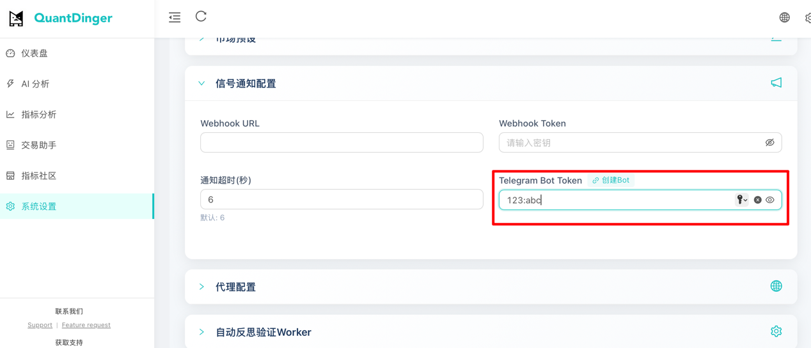
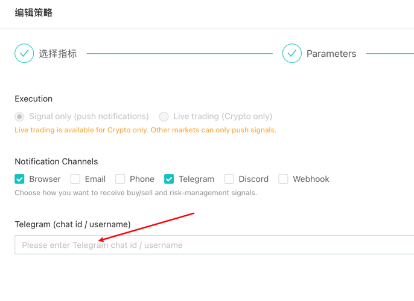

# 📱 Telegram 通知配置指南

> QuantDinger 支持通过 Telegram Bot 推送策略信号通知，实时获取交易提醒。

---

## 📋 目录

- [前置要求](#前置要求)
- [第一步：创建 Telegram Bot](#第一步创建-telegram-bot)
- [第二步：获取 Bot Token](#第二步获取-bot-token)
- [第三步：获取您的 User ID](#第三步获取您的-user-id)
- [第四步：配置环境变量](#第四步配置环境变量)
- [第五步：策略中启用 Telegram 通知](#第五步策略中启用-telegram-通知)
- [常见问题](#常见问题)

---

## 前置要求

- 已安装 Telegram 客户端（手机或桌面版）
- 拥有 Telegram 账号
- QuantDinger 后端服务已部署并运行

---

## 第一步：创建 Telegram Bot

1. 在 Telegram 中搜索 **@BotFather**（官方机器人管理工具）
2. 发送 `/newbot` 命令开始创建新机器人
3. 按照提示输入机器人名称（如：`QuantDinger Signal Bot`）
4. 输入机器人用户名（必须以 `bot` 结尾，如：`quantdinger_signal_bot`）



---

## 第二步：获取 Bot Token

创建成功后，BotFather 会返回一个 **HTTP API Token**，格式如下：

```
123456789:ABCdefGHIjklMNOpqrsTUVwxyz
```

> ⚠️ **安全提示**：请妥善保管此 Token，不要泄露给他人。如果 Token 泄露，请立即在 BotFather 中使用 `/revoke` 命令重新生成。

---

## 第三步：获取您的 User ID

### 方法一：通过 API 获取（推荐）

1. 先向您刚创建的 Bot 发送任意消息（如 `/start`）
2. 在浏览器中访问以下 URL（将 `YOUR_BOT_TOKEN` 替换为您的 Token）：

```
https://api.telegram.org/bot{YOUR_BOT_TOKEN}/getUpdates
```

**示例**：
```
https://api.telegram.org/bot123456789:ABCdefGHIjklMNOpqrsTUVwxyz/getUpdates
```

3. 在返回的 JSON 中找到 `chat.id` 字段，这就是您的 User ID


### 方法二：通过 @userinfobot 获取

1. 在 Telegram 中搜索 **@userinfobot**
2. 发送任意消息，机器人会返回您的 User ID

---

## 第四步：配置环境变量

在 `backend_api_python/.env` 文件中配置 Bot Token：

```bash
# Telegram Bot Token（必填）
TELEGRAM_BOT_TOKEN=123456789:ABCdefGHIjklMNOpqrsTUVwxyz
```

配置完成后重启后端服务使配置生效。

---

## 第五步：策略中启用 Telegram 通知

在策略配置页面的「信号通知」设置中：

1. 勾选启用 **Telegram** 通知渠道
2. 在 **User ID** 字段填入您的 Telegram User ID



> 💡 **提示**：支持填入多个 User ID（逗号分隔）或群组/频道 ID，实现多人通知。

---

## 常见问题

### Q: 收不到通知怎么办？

1. 确认已向 Bot 发送过消息（Bot 需要先被激活）
2. 检查 `TELEGRAM_BOT_TOKEN` 环境变量是否正确配置
3. 确认 User ID 填写正确
4. 查看后端日志是否有错误信息

### Q: 可以发送到群组吗？

可以。将 Bot 添加到群组后，使用群组 ID（负数）作为 User ID 即可。获取群组 ID 的方法与获取个人 ID 类似。

### Q: Token 格式是什么？

Token 格式为 `数字:字母数字字符串`，例如 `123456789:ABCdefGHIjklMNOpqrsTUVwxyz`

---

## 相关文档

- [邮箱 SMTP 通知配置](./NOTIFICATION_EMAIL_CONFIG_CH.md)
- [手机短信通知配置](./NOTIFICATION_SMS_CONFIG_CH.md)
- [策略开发指南](./STRATEGY_DEV_GUIDE_CN.md)
