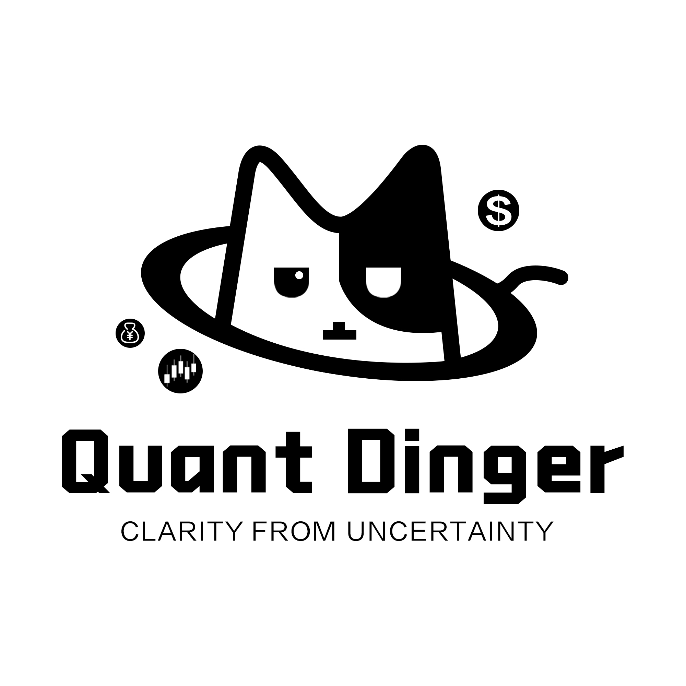
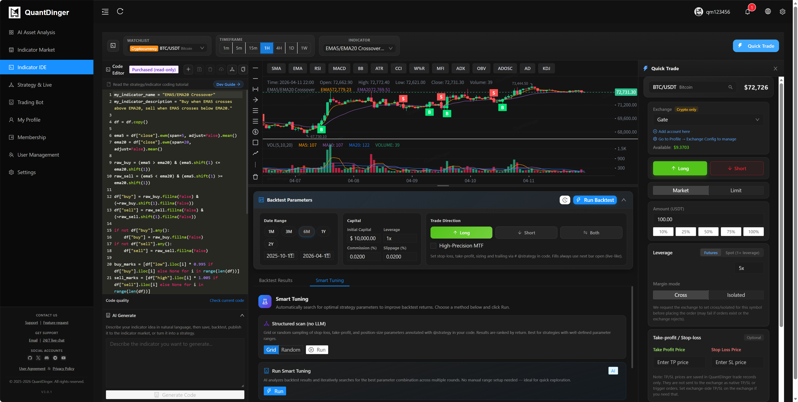
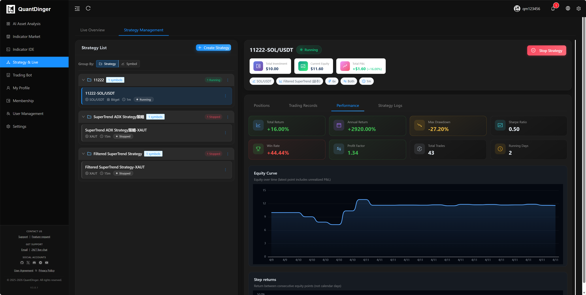
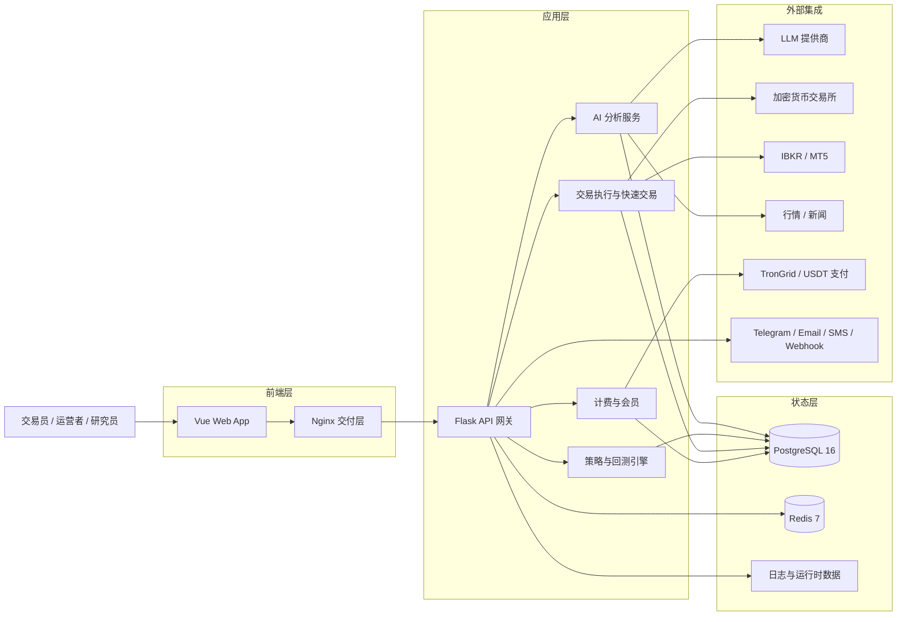

<div align="center">
  <a href="https://github.com/brokermr810/QuantDinger">
    
  </a>

  <h1>QuantDinger</h1>
  <h3>你的私有化 AI 量化操作系统</h3>
  <p><strong>把市场研究、Python 策略生成、回测验证和实盘执行，全部放进一套由你自己掌控的基础设施。</strong></p>
  <p><em>可自托管、AI 原生、面向研究员、交易员、量化开发者和运营团队的完整工作台。</em></p>

  <p>
    <a href="../README.md"><strong>English</strong></a> &nbsp;·&nbsp;
    <a href="README_CN.md"><strong>简体中文</strong></a> &nbsp;·&nbsp;
    <a href="https://ai.quantdinger.com"><strong>在线演示</strong></a> &nbsp;·&nbsp;
    <a href="https://www.youtube.com/watch?v=tNAZ9uMiUUw"><strong>视频演示</strong></a> &nbsp;·&nbsp;
    <a href="https://www.quantdinger.com"><strong>官网</strong></a> &nbsp;·&nbsp;
    <a href="https://t.me/quantdinger"><strong>Telegram</strong></a> &nbsp;·&nbsp;
    <a href="https://discord.com/invite/tyx5B6TChr"><strong>Discord</strong></a> &nbsp;·&nbsp;
    <a href="https://youtube.com/@quantdinger"><strong>YouTube</strong></a>
  </p>

  <p>
    <a href="../LICENSE"></a>
    
    
    
    
    
  </p>
</div>

---

> QuantDinger 是一个**可自托管、以本地优先为设计原则的量化交易与算法交易平台**，把 **AI 研究、Python 策略生成、回测验证和实盘执行** 放进同一套系统里。

## 两分钟试用

**最快的本地体验方式：**

```bash
git clone https://github.com/brokermr810/QuantDinger.git && cd QuantDinger && cp backend_api_python/env.example backend_api_python/.env && ./scripts/generate-secret-key.sh && docker-compose up -d --build
```

启动后：

- 打开 `http://localhost:8888`
- 默认登录：`quantdinger` / `123456`
- 正式环境部署前请先检查 `backend_api_python/.env`

## QuantDinger 是什么？

QuantDinger 是一个**可自托管的 AI 交易平台**，也是一套**量化研究与策略运行工作台**，适合希望用一套系统完成以下工作的人：

- AI 市场分析
- Python 指标与策略开发
- 回测与策略持久化
- 实盘交易执行
- 组合监控与通知
- 多用户运营、计费与商业化

如果你正在寻找的是**开源量化平台**、**AI 交易研究系统**、**可自托管回测系统**，或者**自然语言生成 Python 策略工作流**，QuantDinger 就是按这个方向设计的。

## 为什么选择 QuantDinger？AI 驱动的量化交易与回测平台

- **默认可自托管**：密钥、策略代码、交易流程和业务数据都掌握在你自己手里。
- **研究到执行一体化**：AI 分析、图表、策略、回测、快速交易和实盘运营在同一条产品链路里。
- **Python 原生 + AI 辅助**：既能直接写 Python，也能让 AI 加速策略草拟和迭代。
- **面向运营落地，而不是只做演示**：Docker Compose、PostgreSQL、Redis、Nginx、健康检查、工作进程开关和环境变量配置都已经成型。
- **天然支持商业化**：会员、积分、后台管理和 USDT 支付能力都在同一套系统内。

## 核心承诺

QuantDinger 真正想提供的，不只是一个“量化工具”，而是：

- **一套系统替代五六个零散工具**
- **AI 直接嵌入研究和交易流程，而不是挂在旁边**
- **既保留 Python 灵活性，也保留产品化体验**
- **既支持私有化部署，也支持后续运营和增长**

## QuantDinger 和拼装式方案有什么区别

| 常见拼装方式 | QuantDinger |
|--------------|-------------|
| AI 聊天工具和真实策略流程割裂 | AI 分析、AI 生成代码、回测反馈、执行流程在同一产品里闭环 |
| 图表、脚本、机器人、通知系统各自分散 | 一套可部署平台统一承载图表、策略、运行时、通知和运营 |
| SaaS 工具方便但对密钥、alpha 和数据控制有限 | 可自托管架构，基础设施、密钥和业务数据都在你自己手里 |
| 只有研究工具，没有运营层 | 内置多用户、权限、积分、计费、后台管理和部署能力 |

## 适合谁用

- **交易员和量化研究者**：希望使用 AI 做市场研究，但又不想放弃对数据和基础设施的控制权。
- **Python 策略开发者**：希望在同一个环境里完成图表、策略开发、回测与实盘。
- **小团队和工作室**：需要搭建私有研究平台或内部交易工具。
- **运营方和创业团队**：需要一个可部署、带用户体系和计费能力的量化产品底座。

## 典型使用场景

- **AI 辅助市场研究**：覆盖加密货币、美股、外汇和跨市场研究流程
- **Python 原生策略开发**：适合量化交易与算法交易团队
- **回测与参数迭代**：适合信号策略、已保存策略和执行假设验证
- **私有化交易基础设施**：适合重视可自托管与隐私优先的团队
- **商业化量化产品**：适合需要用户、计费、积分和后台控制的运营方

## 视觉导览

<table align="center" width="100%">
  <tr>
    <td colspan="2" align="center">
      <a href="https://www.youtube.com/watch?v=tNAZ9uMiUUw">
        
      </a>
      <br/>
      <sub>
        <a href="https://www.youtube.com/watch?v=tNAZ9uMiUUw">
          <strong>▶ 观看产品演示视频</strong>
        </a>
      </sub>
      <br/>
      <sub>点击上方预览卡片，即可跳转到完整视频讲解。</sub>
    </td>
  </tr>
  <tr>
    <td width="50%" align="center"><br/><sub>指标 IDE、图表研究、回测与快速交易</sub></td>
    <td width="50%" align="center"><br/><sub>AI 资产分析与机会雷达</sub></td>
  </tr>
  <tr>
    <td align="center"><br/><sub>交易机器人工作台与自动化模板</sub></td>
    <td align="center"><br/><sub>策略实盘运营、绩效与监控</sub></td>
  </tr>
</table>

## 用 QuantDinger 可以做什么

### AI 研究与决策支持

- 用 AI 快速分析价格行为、K 线结构、宏观/新闻背景和其他外部输入。
- 存储分析历史和记忆，方便复盘、对比和后续校准。
- 通过环境变量接入 OpenRouter、OpenAI、Gemini、DeepSeek 等多种 LLM。
- 可选启用多模型协同、结果校准等机制，提高 AI 输出稳定性。

### 指标与策略开发

- 使用 `IndicatorStrategy` 开发基于数据表的信号、叠加指标和图表回测。
- 使用 `ScriptStrategy` 开发有状态、可显式控制下单动作的运行时策略。
- 用自然语言生成指标代码或策略代码，再继续用 Python 深度修改。
- 在专业 K 线界面里直接查看指标、买卖点和策略输出。

### 回测与策略迭代

- 运行历史回测，查看交易明细、指标结果和资金曲线。
- 同时支持指标驱动型回测和已保存策略驱动型回测。
- 持久化策略快照和历史运行结果，方便复现与审计。
- 结合 AI 做回测后的参数建议、风控调整和策略迭代。

### 实盘与运营

- 通过统一执行层连接多家加密货币交易所。
- 使用快速交易链路，从分析结果直接进入交易动作。
- 查看持仓、交易历史，并在平台内执行平仓。
- 用运行时服务和后台工作进程支撑半自动或自动化策略运营。

### 多市场覆盖

- 加密货币现货与衍生品
- 通过 IBKR 接入美股
- 通过 MT5 接入外汇
- 通过 Polymarket 工作流做预测市场研究

### 多用户、通知与计费

- 基于 PostgreSQL 的多用户体系和角色权限模型。
- 支持 Google、GitHub OAuth 登录。
- 支持 Telegram、Email、SMS、Discord、Webhook 等通知方式。
- 支持会员、积分、USDT TRC20 支付和后台计费管理。

## AI 能力

QuantDinger 不是简单地“在交易软件里加了个 LLM 聊天框”，而是把 AI 放进了真正的研究、策略和迭代流程里。

### 快速分析

- 结构化的 AI 市场分析流程
- 比旧式多跳编排更轻、更快
- 适合日常复盘、交易计划和机会筛选

### AI 指标与策略生成

- 自然语言生成 Python 指标代码
- 自然语言生成策略代码和配置骨架
- 更适合“我知道想做什么，但不想从零搭代码”的交易者

### 分析记忆与历史回顾

- 保存历史分析结果
- 提高复盘一致性和可比性
- 为后续校准与反思链路打基础

### 多模型协同、校准与反思

- 可选多模型协同配置
- 支持置信度校准与反思式工作进程
- 更适合追求稳定输出和长期运营的团队

### AI 辅助回测反馈

- 回测结果可以喂给 AI 生成建议
- 适用于参数调优、风险调整和更快迭代

### Polymarket 与跨市场研究

- 把预测市场作为研究型工作流接入
- 对比 AI 观点与市场隐含概率
- 输出分歧分析和机会评分

## 它和普通交易工具有什么不同

很多交易系统只能解决其中一两段链路，但 QuantDinger 试图给你一整套“量化操作系统”：

1. **可自托管基础设施**
2. **AI 研究工作流**
3. **Python 策略开发**
4. **回测**
5. **实盘执行**
6. **组合与通知运营**
7. **商业化底层能力**

这套组合，本身就是它最核心的差异化。

## 为什么它比普通交易工具更容易打动用户

- **对交易员**：它缩短了从交易想法到交易动作的距离。
- **对量化开发者**：它把 Python 和策略控制权放在核心位置。
- **对运营方**：它补上了很多开源交易项目缺失的用户、计费、角色和部署能力。
- **对 AI 工作流**：它让分析结果变得可执行、可复盘、可逐步自动化。

## 它是怎么工作的

从系统层面看，QuantDinger 是一套可自托管应用栈：

- 预构建 Vue 前端，由 Nginx 托管
- Flask API 后端，承载 Python 服务层
- PostgreSQL 存储用户、策略、历史和业务状态
- Redis 提供后台工作进程支撑和运行时协调
- 外部通过交易所、经纪商、AI、支付、通知等适配器接入

### 架构摘要

| 层级 | 技术 |
|------|------|
| 前端 | 预构建 Vue 应用，由 Nginx 托管 |
| 后端 | Flask API、Python 服务层、策略运行时 |
| 存储 | PostgreSQL 16 |
| 缓存 / 后台工作进程支撑 | Redis 7 |
| 交易层 | 多交易所适配、IBKR、MT5 |
| AI 层 | LLM 接入、记忆、校准、可选后台工作进程 |
| 计费层 | 会员、积分、USDT TRC20 支付 |
| 部署 | 带健康检查的 Docker Compose |

### 执行模型

- 行情通过可插拔数据层拉取。
- 回测在服务端策略引擎中执行，并支持策略快照。
- 实盘策略由运行时服务生成下单意图。
- 待执行订单再交给交易所专用执行适配器处理。
- 加密货币实盘执行与行情采集是刻意分层的。

### 系统架构图



## 快速开始

> 只需安装 [Docker](https://docs.docker.com/get-docker/)。由于仓库已内置 `frontend/dist`，部署时不需要再安装 Node.js 来构建前端。

### Linux / macOS

```bash
git clone https://github.com/brokermr810/QuantDinger.git
cd QuantDinger
cp backend_api_python/env.example backend_api_python/.env
./scripts/generate-secret-key.sh
docker-compose up -d --build
```

### Windows PowerShell

```powershell
git clone https://github.com/brokermr810/QuantDinger.git
cd QuantDinger
Copy-Item backend_api_python\env.example -Destination backend_api_python\.env
$key = py -c "import secrets; print(secrets.token_hex(32))"
(Get-Content backend_api_python\.env) -replace '^SECRET_KEY=.*$', "SECRET_KEY=$key" | Set-Content backend_api_python\.env -Encoding UTF8
docker-compose up -d --build
```

启动后：

- 前端地址：`http://localhost:8888`
- 后端健康检查：`http://localhost:5000/api/health`
- 默认登录：`quantdinger` / `123456`

部署注意事项：

- 如果 `SECRET_KEY` 仍然使用默认值，后端容器不会启动。
- 主要配置文件位于 `../backend_api_python/.env`。
- 根目录 `.env` 是可选项，主要用于镜像源和端口覆盖。
- 默认栈包含 `frontend`、`backend`、`postgres`、`redis`。

### 常用 Docker 命令

```bash
docker-compose ps
docker-compose logs -f backend
docker-compose restart backend
docker-compose up -d --build
docker-compose down
```

### 可选根目录 `.env`

如果你需要自定义端口或镜像源，可以在根目录创建 `.env`：

```ini
FRONTEND_PORT=3000
BACKEND_PORT=127.0.0.1:5001
IMAGE_PREFIX=docker.m.daocloud.io/library/
```

## 最小示例：Python 指标策略

下面这种 Python 风格，就是 QuantDinger 的典型策略开发方式：

```python
# @param sma_short int 14 短期均线周期
# @param sma_long int 28 长期均线周期

sma_short_period = params.get('sma_short', 14)
sma_long_period = params.get('sma_long', 28)

my_indicator_name = "双均线策略"
my_indicator_description = f"短期{sma_short_period}/长期{sma_long_period}均线交叉策略"

df = df.copy()
sma_short = df["close"].rolling(sma_short_period).mean()
sma_long = df["close"].rolling(sma_long_period).mean()

buy = (sma_short > sma_long) & (sma_short.shift(1) <= sma_long.shift(1))
sell = (sma_short < sma_long) & (sma_short.shift(1) >= sma_long.shift(1))

df["buy"] = buy.fillna(False).astype(bool)
df["sell"] = sell.fillna(False).astype(bool)
```

完整示例见：

- [`examples/dual_ma_with_params.py`](examples/dual_ma_with_params.py)
- [`examples/multi_indicator_composite.py`](examples/multi_indicator_composite.py)
- [`examples/cross_sectional_momentum_rsi.py`](examples/cross_sectional_momentum_rsi.py)

## 支持的市场、经纪商与交易所

### 加密货币交易所

| 平台 | 覆盖范围 |
|------|----------|
| Binance | 现货、期货、杠杆 |
| OKX | 现货、永续、期权 |
| Bitget | 现货、期货、跟单 |
| Bybit | 现货、线性期货 |
| Coinbase | 现货 |
| Kraken | 现货、期货 |
| KuCoin | 现货、期货 |
| Gate.io | 现货、期货 |
| Deepcoin | 衍生品接入 |
| HTX | 现货、USDT 本位永续 |

### 传统市场

| 市场 | 经纪商 / 数据源 | 执行方式 |
|------|------------------|----------|
| 美股 | IBKR、Yahoo Finance、Finnhub | 通过 IBKR |
| 外汇 | MT5、OANDA | 通过 MT5 |
| 期货 | 交易所与数据接入 | 数据与工作流支持 |

### 预测市场

Polymarket 当前定位为**研究与分析工作流**，不是平台内的直接实盘执行模块。它适合做市场检索、分歧分析、机会评分和 AI 辅助研究。

## 策略开发模式

QuantDinger 当前支持两种主要策略开发模式：

### IndicatorStrategy（指标策略）

- 基于数据表的 Python 脚本
- 通过 `buy` / `sell` 生成信号
- 适合图表渲染、信号型回测和指标研究
- 更适合原型验证和可视化策略开发

### ScriptStrategy（脚本策略）

- 基于 `on_init(ctx)` / `on_bar(ctx, bar)` 的事件驱动脚本
- 通过 `ctx.buy()`、`ctx.sell()`、`ctx.close_position()` 显式表达交易动作
- 更适合有状态策略、执行导向逻辑和实盘对齐

完整开发说明见：

- [策略开发指南](STRATEGY_DEV_GUIDE_CN.md)
- [跨品种策略指南](CROSS_SECTIONAL_STRATEGY_GUIDE_CN.md)
- [示例代码](examples/)

示例代码位于 `examples/`，并已与当前策略开发指南保持同步。

## 仓库结构

```text
QuantDinger/
├── backend_api_python/      # 开源后端源码
│   ├── app/routes/          # REST 接口
│   ├── app/services/        # AI、交易、计费、回测、集成能力
│   ├── migrations/init.sql  # 数据库初始化
│   ├── env.example          # 主配置模板
│   └── Dockerfile
├── frontend/                # 预构建前端交付包
│   ├── dist/
│   ├── Dockerfile
│   └── nginx.conf
├── docs/                    # 产品、策略与部署文档
├── docker-compose.yml
├── LICENSE
└── TRADEMARKS.md
```

## 主要配置域

以 `../backend_api_python/env.example` 作为主模板，常见配置包括：

| 配置域 | 示例 |
|--------|------|
| 认证 | `SECRET_KEY`、`ADMIN_USER`、`ADMIN_PASSWORD` |
| 数据库 | `DATABASE_URL` |
| LLM / AI | `LLM_PROVIDER`、`OPENROUTER_API_KEY`、`OPENAI_API_KEY` |
| OAuth | `GOOGLE_CLIENT_ID`、`GITHUB_CLIENT_ID` |
| 安全 | `TURNSTILE_SITE_KEY`、`ENABLE_REGISTRATION` |
| 计费 | `BILLING_ENABLED`、`BILLING_COST_AI_ANALYSIS` |
| 会员 | `MEMBERSHIP_MONTHLY_PRICE_USD`、`MEMBERSHIP_MONTHLY_CREDITS` |
| USDT 支付 | `USDT_PAY_ENABLED`、`USDT_TRC20_XPUB`、`TRONGRID_API_KEY` |
| 代理 | `PROXY_URL` |
| 后台工作进程 | `ENABLE_PENDING_ORDER_WORKER`、`ENABLE_PORTFOLIO_MONITOR`、`ENABLE_REFLECTION_WORKER` |
| AI 调优 | `ENABLE_AI_ENSEMBLE`、`ENABLE_CONFIDENCE_CALIBRATION`、`AI_ENSEMBLE_MODELS` |

## 文档导航

### 核心文档

| 文档 | 说明 |
|------|------|
| [更新日志](CHANGELOG.md) | 版本历史与迁移说明 |
| [多用户部署](multi-user-setup.md) | PostgreSQL 多用户部署说明 |
| [云服务器部署](CLOUD_DEPLOYMENT_CN.md) | 域名、HTTPS、反向代理与云上部署 |

### 策略开发

| 指南 | EN | CN | TW | JA | KO |
|------|----|----|----|----|----|
| 策略开发 | [EN](STRATEGY_DEV_GUIDE.md) | [CN](STRATEGY_DEV_GUIDE_CN.md) | [TW](STRATEGY_DEV_GUIDE_TW.md) | [JA](STRATEGY_DEV_GUIDE_JA.md) | [KO](STRATEGY_DEV_GUIDE_KO.md) |
| 跨品种策略 | [EN](CROSS_SECTIONAL_STRATEGY_GUIDE_EN.md) | [CN](CROSS_SECTIONAL_STRATEGY_GUIDE_CN.md) | - | - | - |
| 示例代码 | [examples](examples/) | - | - | - | - |

### 集成说明

| 主题 | English | 中文 |
|------|---------|------|
| IBKR | [Guide](IBKR_TRADING_GUIDE_EN.md) | - |
| MT5 | [Guide](MT5_TRADING_GUIDE_EN.md) | [指南](MT5_TRADING_GUIDE_CN.md) |
| OAuth | [Guide](OAUTH_CONFIG_EN.md) | [指南](OAUTH_CONFIG_CN.md) |

### 通知配置

| 渠道 | English | 中文 |
|------|---------|------|
| Telegram | [Setup](NOTIFICATION_TELEGRAM_CONFIG_EN.md) | [配置](NOTIFICATION_TELEGRAM_CONFIG_CH.md) |
| Email | [Setup](NOTIFICATION_EMAIL_CONFIG_EN.md) | [配置](NOTIFICATION_EMAIL_CONFIG_CH.md) |
| SMS | [Setup](NOTIFICATION_SMS_CONFIG_EN.md) | [配置](NOTIFICATION_SMS_CONFIG_CH.md) |

## 常见问题

### QuantDinger 真的是可自托管的吗？

是的。默认部署方式就是你自己的 Docker Compose 栈，数据库、Redis、环境变量、API 凭证和业务数据都由你自己控制。

### QuantDinger 只适合做加密货币吗？

不是。加密货币是核心场景之一，但平台也支持 IBKR 的美股链路、MT5 的外汇链路，以及 Polymarket 的研究型分析工作流。

### 我可以直接写 Python 策略吗？

可以。QuantDinger 同时支持基于数据表的 `IndicatorStrategy` 和事件驱动的 `ScriptStrategy`。你也可以先让 AI 生成初稿，再自己继续修改。

### 它到底是研究工具还是实盘交易平台？

两者都是。QuantDinger 想打通的是 AI 研究、图表、策略开发、回测、快速交易和实盘运营，而不是只做其中某一段。

### 可以商用吗？

后端采用 Apache 2.0，前端源码采用单独的 source-available 授权。可以支持商业化，但你需要仔细阅读仓库内的授权说明；如果涉及前端源码、品牌或商业授权，建议直接联系项目方。

## 开源仓库入口

| 仓库 | 作用 |
|------|------|
| [QuantDinger](https://github.com/brokermr810/QuantDinger) | 主仓库：后端、部署栈、文档、预构建前端交付 |
| [QuantDinger Frontend](https://github.com/brokermr810/QuantDinger-Vue) | Vue 前端源码仓库，适合 UI 开发与定制 |

## 交易所合作注册链接

这些链接也可以在应用内通过 **个人中心 -> 开户** 查看。是否享受手续费返佣，以各交易所规则为准。

| 交易所 | 注册链接 |
|--------|----------|
| Binance | [注册开户](https://www.bsmkweb.cc/register?ref=QUANTDINGER) |
| Bitget | [注册开户](https://partner.hdmune.cn/bg/7r4xz8kd) |
| Bybit | [注册开户](https://partner.bybit.com/b/DINGER) |
| OKX | [注册开户](https://www.xqmnobxky.com/join/QUANTDINGER) |
| Gate.io | [注册开户](https://www.gateport.company/share/DINGER) |
| HTX | [注册开户](https://www.htx.com/invite/zh-cn/1f?invite_code=dinger) |

## 许可与商业说明

- 后端源代码采用 **Apache License 2.0**，见 [`../LICENSE`](../LICENSE)。
- 当前仓库中的前端以**预构建文件**形式分发，用于一体化部署。
- 前端源码单独公开在 [QuantDinger Frontend](https://github.com/brokermr810/QuantDinger-Vue)，并适用 **QuantDinger Frontend Source-Available License v1.0**。
- 根据该前端许可证，非商业用途和符合条件的非营利用途可免费使用；商业用途需另行获得授权。
- 商标、品牌、署名和水印相关规则单独管理，未经许可不得移除或修改，详见 [`../TRADEMARKS.md`](../TRADEMARKS.md)。

如需商业授权、前端源码、品牌授权或部署支持，可联系：

- Website: [quantdinger.com](https://quantdinger.com)
- Telegram: [t.me/worldinbroker](https://t.me/worldinbroker)
- Email: [support@quantdinger.com](mailto:support@quantdinger.com)

## 法律声明与合规提示

- QuantDinger 仅可用于合法的研究、教育、系统开发，以及符合法律法规要求的交易或运营场景。
- 任何个人或组织不得将本软件、其衍生版本或相关服务用于任何违法、欺诈、滥用、误导、市场操纵、违反制裁、洗钱或其他被禁止的用途。
- 任何基于 QuantDinger 的商业使用、部署、运营、转售或服务化提供，都必须遵守所在国家或地区的适用法律法规，以及必要的许可、制裁、税务、数据保护、消费者保护、金融监管、市场规则和交易所规则。
- 用户应自行判断其使用行为是否合法，并自行承担审批、备案、披露、牌照或专业法律/税务/合规意见等责任。
- QuantDinger 及其版权方、贡献者、许可方、维护者和相关开源参与方，不提供任何法律、税务、投资、合规或监管意见。
- 在适用法律允许的最大范围内，QuantDinger 及相关权利方和贡献者，对任何因使用或误用本软件导致的违法使用、监管违规、交易损失、服务中断、执法措施或其他后果，不承担责任。

## 从这里开始

- **想先看产品效果？** 先打开[在线演示](https://ai.quantdinger.com)或观看[视频演示](https://www.youtube.com/watch?v=tNAZ9uMiUUw)。
- **想尽快自己部署？** 直接看[快速开始](#快速开始)，用 Docker Compose 拉起来。
- **想开始写策略？** 先看[策略开发指南](STRATEGY_DEV_GUIDE_CN.md)。示例代码位于 [`examples/`](examples/)，并已与开发指南保持同步。
- **想上云或生产部署？** 看[云服务器部署文档](CLOUD_DEPLOYMENT_CN.md)。
- **想做商业授权或定制化？** 直接通过 [quantdinger.com](https://quantdinger.com) 联系项目方。

## 社区与支持

<p>
  <a href="https://t.me/quantdinger"></a>
  <a href="https://discord.com/invite/tyx5B6TChr"></a>
  <a href="https://youtube.com/@quantdinger"></a>
</p>

- [贡献指南](../CONTRIBUTING.md)
- [问题反馈 / 功能建议](https://github.com/brokermr810/QuantDinger/issues)
- Email: [support@quantdinger.com](mailto:support@quantdinger.com)

## 支持项目

```text
0x96fa4962181bea077f8c7240efe46afbe73641a7
```

## Star 趋势

[](https://star-history.com/#brokermr810/QuantDinger&Date)

## 致谢

QuantDinger 建立在优秀的开源生态之上，特别感谢以下项目：

- [Flask](https://flask.palletsprojects.com/)
- [Pandas](https://pandas.pydata.org/)
- [CCXT](https://github.com/ccxt/ccxt)
- [yfinance](https://github.com/ranaroussi/yfinance)
- [Vue.js](https://vuejs.org/)
- [Ant Design Vue](https://antdv.com/)
- [KLineCharts](https://github.com/klinecharts/KLineChart)
- [ECharts](https://echarts.apache.org/)
- [Capacitor](https://capacitorjs.com/)
- [bip-utils](https://github.com/ebellocchia/bip_utils)

<p align="center"><sub>如果 QuantDinger 对你有帮助，欢迎点一个 GitHub Star。</sub></p>
